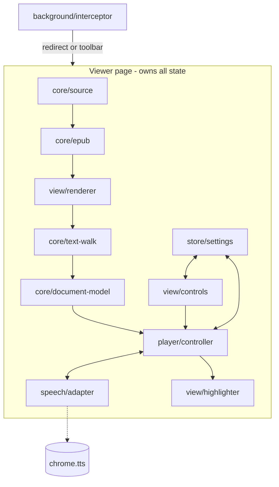

# EPUB Reader — Planned Architecture

Status: **planned. Nothing is built.** This document is the design and the build order; no file in this directory exists yet apart from this one.

It is the sibling of [`../pdf-reader/architecture.md`](../pdf-reader/architecture.md), and it is deliberately written in the same shape, because **this extension is mostly that extension with a different front half**. Where a section here says "unchanged from pdf-reader", it means literally that — the same file, copied.

Like its sibling, this was written as a plan and is meant to be kept as a record: as each phase is built, fold what it found back into the design sections so they can later be read as fact rather than intention.

**To pick up work:** read section 3 (module map), then section 11 (build phases), and start at phase 0.

## 0. Where things stand

| Phase | State | Notes |
|---|---|---|
| 0 — ZIP and DRM probe | **done** | All 113 test books open by hand-rolled ZIP; nothing vendored. Two surprises: OPF elements can be namespace-prefixed, and `encryption.xml` usually means font obfuscation, not DRM. See 2.5 |
| 1 — Shell, entry points, viewer page | **mostly done** | Viewer, picker and drag-and-drop confirmed in Chrome. Still open: the toolbar button, the context menu, and open question 3. A `file://` source failed to read on this machine even with the switch on — see below |
| 2 — `core/epub.js`: ZIP, OPF, spine | **done** | Exercised on all 113 books outside Chrome and on the key books in Chrome. Added finding 5: a malformed chapter needs the HTML-parser fallback |
| 3 — Render chapters | **done** | `adoptedStyleSheets` worked first try, so open question 4 never arose. Isolation confirmed against a book that styles `body`, `h1` and `p`. Found the SVG `xlink:href` rewriting bug (2.4) |
| 4 — Text model | **not started** | Half of it is copied from pdf-reader |
| 5 — Audio | **not started** | Two files copied verbatim, then wiring |
| 6 — Highlight | **not started** | CSS Custom Highlight API. Answers open question 5 |
| 7 — Controls, settings, resume, click-to-read | **not started** | |

### Working this document

It is written so a session that has never seen this project can open it cold, read sections 3 and 11, and start. Keeping that true costs a few minutes at the end of every phase:

- **Mark the phase done in the table above**, and say in one line what it actually found — especially where reality differed from the stance written here.
- **Fold the findings back into the design sections**, so sections 1-10 can later be read as fact rather than intention. Every open question in section 10 names the phase that answers it; answer it there, in place, and strike the question.
- **Commit at the end of each phase**, with the phase named in the message. `git log` in this repo is then the second copy of the table above.
- **Rename this file to `architecture.md`** once phase 7 is confirmed in Chrome, and write the user-facing `README.md` then — the sibling extension's split between the two is the model.

**Where things are copied from.** Every "copy from pdf-reader" below means the file at the same path under `../pdf-reader/`. Read [`../pdf-reader/architecture.md`](../pdf-reader/architecture.md) alongside this document — its sections 2.2-2.7 are measurements this design rests on and does not repeat.

**The test corpus.** Phase 0 gathers DRM-free books to probe against. Record where they live in 2.5 and reuse the same set in every later phase's exit criteria — "every test book" throughout means that set, so a cold session knows what to run against.

**The debug object.** `window.epubReader` in `viewer.js` grows as the phases do, mirroring pdf-reader's `pdfReader`: phase 2 adds `spine()`, phase 4 adds `sentences()`, phase 5 adds `trace`, phase 6 adds `highlight()`, phase 7 adds `voices()` and `forget()`. Several exit criteria below are written in terms of it, so add each entry in the phase that needs it rather than leaving them all to the end.

## 1. What we are building

A Chrome extension that opens an EPUB in its own viewer and reads it aloud using the text-to-speech voices Chrome already has on the machine, highlighting each word as it is spoken.

In other words: what `pdf-reader` does, for books.

### Goals

- Read any DRM-free EPUB aloud, from a local file or from the web.
- Use Chrome's built-in neural voices. Ship no TTS model of our own.
- Highlight the current word and the sentence around it, in sync with the audio.
- Keep the book on the machine. No network calls with book content.
- Remember where the user stopped in a book.
- **Look and behave like `pdf-reader`.** Same header, same controls in the same order, same notice bar, same click-a-word-to-read-from-there gesture, same resume message. Someone who uses both should not have to learn a second interface.

### Non-goals (for v1)

- **DRM'd books.** Adobe ADEPT and Kindle formats cannot be opened, and no amount of design changes that. Detect and say so plainly, the way pdf-reader detects a scan.
- **Pagination.** A scrolling column, decided with the user. Paginated reading is section 12.
- **Table of contents.** EPUBs ship a nav document so the data is free, but a sidebar is the first thing that would make this look unlike pdf-reader. Section 12.
- Cloud voices — measured unusable in pdf-reader 2.3 for a reason that has nothing to do with the file format.
- EPUB 3 Media Overlays (SMIL narration). Rare in practice, and a different feature: it replaces our TTS rather than using it.
- Bookmarks, notes, search, library management.

## 2. Constraints

### 2.1 Everything pdf-reader measured about speech still holds

Sections 2.2 through 2.5 and 2.7 of [`../pdf-reader/architecture.md`](../pdf-reader/architecture.md) are about `chrome.tts` and the machine's voices. **None of it is about PDFs.** It carries over without re-measuring:

- Chrome's `(Natural)` voices synthesise **locally**, from a WASM engine and cached voice models. No network call, no privacy cost.
- Seven of them exist on this machine, all `remote: false`, all declaring `word` in `eventTypes`.
- Network voices emit **zero** word-boundary events, so they cannot be highlighted and are hidden from the picker.
- Natural voices fire `start` **eight times** per utterance, and **two `word` events per word** at distinct `charIndex` values.
- Synthesis latency scales with input size — ~3 s for a paragraph, ~200 ms for a sentence — which is why we chunk by sentence.
- `chrome.tts` has no user-activation gate; `speechSynthesis` does.
- MV3 service workers suspend after ~30 s idle, so playback state cannot live in one.

`speech/adapter.js` already absorbs all three quirks, which is exactly why it can be copied over untouched.

### 2.2 EPUB is a ZIP of XHTML — which removes most of pdf-reader's hard part

An EPUB is a ZIP archive containing:

```
mimetype                     "application/epub+zip", stored uncompressed
META-INF/container.xml       points at the OPF
OEBPS/content.opf            manifest (every file) + spine (reading order)
OEBPS/chapter1.xhtml …       the content
OEBPS/style.css, images/ …   resources
```

The content is **HTML**. That single fact deletes the hardest half of pdf-reader:

| pdf-reader had to | epub-reader does not |
|---|---|
| Rebuild words from positioned glyph runs | HTML has real word boundaries |
| Rebuild lines from baseline jumps and `hasEOL` | The browser lays out lines |
| Interpolate each word's box from character counts | No boxes needed at all |
| Rejoin words hyphenated across a line break | Line breaks are the browser's, not the file's |
| Paint highlights as absolutely-positioned overlay divs | `Range` + the CSS Custom Highlight API |
| Re-derive geometry on every zoom change | Text reflows; highlights follow for free |

**Consequence:** the geometry half of `core/document-model.js` and nearly all of `view/highlighter.js` are deleted rather than ported, and the text-model half — the part validated against eight real documents — is copied unchanged.

### 2.3 The browser can open a ZIP without help

`DecompressionStream('deflate-raw')` is built into Chrome. Every EPUB entry is either *stored* or *deflated*. So reading the archive is: locate the end-of-central-directory record, walk the central directory, and inflate the entries we want. Roughly 150 lines, no dependency.

This is stated as a **plan, not a measurement** — phase 0 exists to check it against real books. If any book fails, the fallback is to vendor `zip.js` in `lib/` exactly as pdf.js was vendored in the sibling extension.

### 2.4 A book's CSS is hostile by default

Unlike a PDF, an EPUB ships stylesheets that were written to control a whole page. Dropping a chapter's markup and its `<style>` into our viewer would let the book restyle our header, our controls and our notice bar.

**Consequence:** every chapter is rendered inside a **shadow root**, with the book's CSS inside it. This is the one genuinely new piece of engineering in the project and the main risk (section 9, phase 3).

**Phase 3 confirmed this works,** and that the isolation is real: with a book loaded whose stylesheets style `body`, `h1` and `p`, the header's `h1`, the buttons and the page background all keep their own computed styles. Two things phase 3 learned in passing:

- **Resource URLs must be rewritten on the `Attr` node, matched by `localName`.** A cover page is usually an SVG `<image xlink:href="cover.jpeg">`. That attribute is namespaced, so a `[xlink\:href]` selector does not match it, and `setAttribute("xlink:href", url)` would add a *second*, unnamespaced attribute beside the original rather than replacing it — leaving the image still pointing at a path that does not resolve. Walking `el.attributes` and assigning `attr.value` keeps whatever namespace the attribute already had.
- **The book's font sizes have to be overridden, its font families kept.** A book that sets `body { font-size: 12pt }` would otherwise ignore the header's font-size control completely. The base stylesheet forces `font-size: inherit` on the block elements and leaves everything else to the book.

### 2.5 Phase 0's findings

**The test corpus** is `~/Desktop/Reading` — **113 EPUBs**, mostly technical and trade non-fiction, a wide producer spread. "Every test book" throughout this document means that folder. The probe script was throwaway and is gone; its findings are below.

**All 113 opened with the hand-rolled ZIP reader.** No book needed anything `DecompressionStream` does not provide.

| Measure | Result across 113 books |
|---|---|
| Compression methods | **stored (0) and deflate (8) only** — nothing else, in any book |
| zip64 | **0 books**. Largest archive is 14 MB, far under the 4 GB threshold |
| Data descriptors (flag bit 3) | **1 book**. Harmless — see below |
| `META-INF/encryption.xml` | **1 book**, and it is *not* DRM — see below |
| EPUB version | 81 × EPUB 2, 32 × EPUB 3 |
| Producer | 50 × Calibre, 43 × no contributor recorded, 7 × Epubor, rest one-offs (Pages, Smashing, InDesign-ish) |
| Spine length | min 2, median 32, **max 224** |
| Total XHTML per book | min 146 KB, median 738 KB, **max 14 MB** |

Four things the corpus taught that the design did not anticipate:

**1. The local header must be re-read to find an entry's data.** A central directory entry's name and extra-field lengths need not match those in the local file header, so the data offset has to be computed as `localOffset + 30 + localNameLen + localExtraLen`, reading those two lengths from the local header itself. Using the central directory's lengths gives a byte offset that is wrong on some books.

**2. Data descriptors are a non-issue.** The one book that sets flag bit 3 reads correctly, because the sizes in the *central directory* are always authoritative and filled in — the descriptor exists for a streaming writer's benefit, not a reader's. Since we already read sizes from the central directory, there is nothing to handle.

**3. OPF elements can be namespace-prefixed.** Two books ship `<opf:spine>` / `<ns0:itemref>` rather than bare element names. `getElementsByTagName("spine")` returns nothing for these in an XML document, which silently produces an **empty spine and a blank book** rather than an error. `core/epub.js` must select by local name in any namespace:

```js
doc.getElementsByTagNameNS("*", "spine")   // not getElementsByTagName("spine")
```

The same applies to `manifest`, `item`, `itemref`, `package` and the `dc:` metadata. This is the single easiest way to get phase 2 wrong.

Phase 2 ended up going one step further and filtering on `localName` instead:

```js
[...node.getElementsByTagName("*")].filter((el) => el.localName === name)
```

`getElementsByTagNameNS("*", …)` is correct in Chrome, but it is exactly the kind of call whose behaviour differs between DOM implementations — of the two used to check this module outside Chrome, one returned nothing for it and the other returned nothing for `getElementsByTagName("*")` either. Matching `localName` depends on no namespace subtleties at all and cannot be read two ways. The OPFs are small enough that walking them costs nothing.

**4. A spine item can be missing from the archive.** Two books (the same title twice) list a chapter in the spine that simply is not in the ZIP. This makes section 8's "skip it, mark the slot failed, keep the rest readable" rule **load-bearing rather than defensive** — it fires on 2 % of a real shelf.

**5. A chapter can be malformed XHTML** (found in phase 2, running `core/epub.js` over the same corpus). *The Society of Mind* has a chapter closing a `<p>` over an open `<span>`. XHTML is XML, so a strict parse rejects it outright. Re-reading the same bytes as `text/html` recovers it, because the HTML parser is *required* to repair rather than reject. `section()` therefore falls back to an HTML parse — this is not defensive coding, it is the only way that book opens.

#### `encryption.xml` does not mean DRM

The one book carrying `META-INF/encryption.xml` is **fully readable**. Its encryption block covers only `fonts/*.otf`, with `Algorithm="http://ns.adobe.com/pdf/enc#RC"` — this is Adobe **font obfuscation**, a scheme for satisfying font licences, and it is common in commercially produced EPUBs. The OPF, the spine and every content document are plain.

So the stance written in open question 2 was wrong, and taking it literally would have refused to open a perfectly good book. The rule `core/epub.js` uses instead:

- Parse `encryption.xml` and collect every `<CipherReference URI="…">`.
- **DRM** = an encrypted URI that is a content document — the OPF, or any spine item.
- **Font obfuscation** = every encrypted URI is a resource that is not in the spine. The book opens normally; an obfuscated font simply fails to load and the reader falls back to its own font, which is what we want anyway.

Caveat worth stating plainly: this rule is derived from a corpus with **exactly one** encrypted book in it. No genuinely DRM'd book was available to test the true-positive side, so "we detect ADEPT DRM" remains reasoning, not measurement. The failure mode is at least the safe one — an unopenable book fails at "no OPF" or "not a ZIP" regardless.

**Note on where this ran.** The probe ran in node 24, not Chrome, because `DecompressionStream('deflate-raw')`, `DataView`, `Blob` and `TextDecoder` are the same Web APIs in both and node could sweep 113 books unattended. Only the XML scraping differed (regex there, `DOMParser` in the real thing), which is why finding 3 above matters. Chrome confirmation of this layer comes in phase 2, against the same corpus.

## 3. Module map

Identical in shape to pdf-reader's, with `core/parser` (pdf.js) replaced by `core/epub` (ZIP + OPF) and a small `core/text-walk` added. The three-way separation is the same: **what the book says** / **how it is spoken** / **how it is drawn**, and they never import each other.



The one arrow that differs from pdf-reader is `view/renderer → core/text-walk → core/document-model`. In pdf-reader the model was fed by the parser; here the text only exists once a chapter is in the DOM, so the renderer feeds it. **The model still imports nothing** — see 4.2 for why that matters and how it is preserved.

### Layer responsibilities

| Module | Responsibility | Must not know about |
|---|---|---|
| `background/interceptor` | Detect EPUB navigation, redirect to our viewer; toolbar and context-menu entry points | Book content, speech, UI |
| `core/source` | URL or picked file → bytes, hashed for the document key | ZIP, speech |
| `core/epub` | ZIP reading, `container.xml`, OPF manifest and spine, resource lookup | Sentences, speech, the viewer's DOM |
| `core/text-walk` | One chapter's rendered DOM → an ordered array of `{ text, node }` runs | Sentences, speech, EPUB structure |
| `core/document-model` | Text runs → words and sentences, each word carrying its DOM node and offset | ZIP, speech, the DOM API |
| `player/controller` | Queue, scheduling, play/pause/seek, current position | EPUB, DOM, voice specifics |
| `speech/adapter` | Speak a string, report word position, stop | Documents, sections, DOM |
| `view/renderer` | Put chapters on screen, in shadow roots, lazily | Speech, sentences |
| `view/highlighter` | Paint word and sentence highlight from a position event | Speech engines, EPUB |
| `view/controls` | Buttons, voice picker, rate slider | Everything except controller + settings |
| `store/settings` | Persist voice, rate, last position | Everything else |

**The pivot is still `core/document-model`.** Text goes in, sentences come out, playback and highlighting both read through it.

## 4. Data model

### 4.1 Shapes

```ts
// Built lazily: sectionCount is known from the spine up front, sentences grow
// as chapters are rendered and walked. Sections are always parsed in reading
// order, so a Sentence.id never shifts once assigned.
interface DocumentModel {
  sectionCount: number
  parsedSections: number
  sentences: Sentence[]        // flat, in reading order
}

interface Sentence {
  id: number                   // index into sentences[]
  section: number              // spine index
  start: number                // char offset into the section's text — for resume
  text: string                 // what we hand to the TTS engine
  words: Word[]
}

interface Word {
  text: string
  start: number                // char offset within Sentence.text
  end: number
  node: Text                   // the DOM text node it came from
  nodeStart: number            // offset within that node
  nodeEnd: number
}

// Emitted by the controller as playback advances. Unchanged from pdf-reader.
interface Position {
  sentenceId: number
  wordIndex: number
}
```

The only real change from pdf-reader is `Word`: `rects: Rect[]` in page coordinates becomes a DOM node plus offsets. `Sentence` gains `section` in place of `page`, and a `start` offset that section 4.3 needs.

A word that spans two text nodes — `dis<em>connect</em>ed` — is kept as a single `Word` whose `node`/`nodeStart` mark its beginning and whose range ends at `nodeEnd` in a later node; the highlighter builds one `Range` across both, which is the DOM equivalent of pdf-reader's multi-`rect` wrapped word. Phase 4 confirms this case.

### 4.2 Keeping `core/document-model` free of the DOM

pdf-reader's best property is that its model imports **nothing** — not pdf.js, not the DOM — which is what let its sentence splitting be checked against eight real PDFs in plain node before Chrome ever ran it. That is worth more than any convenience and is preserved here.

So the model is handed a plain array of runs:

```ts
interface TextRun { text: string; node: unknown }   // node is opaque to the model
```

`core/text-walk` produces these with a `TreeWalker` over the rendered chapter, skipping `script`, `style`, and elements whose computed `display` is `none`. The model treats `node` as an opaque token it stores and hands back. It never calls a DOM method, so it still runs in node with `node` set to a plain string.

### 4.3 Document key and resume position

**Document key:** SHA-256 of the EPUB bytes, exactly as pdf-reader. Survives the file being moved or a signed URL expiring.

**Position:** `{ spineIndex, charOffset }`, **not** pdf-reader's bare `sentenceId`. A sentence id is an index into a list produced by the splitter, so any future change to the splitter silently moves every saved position to the wrong place. A character offset into a chapter does not. On open: parse up to `spineIndex`, then pick the sentence whose `[start, start+text.length)` contains `charOffset`, falling back to the first sentence starting after it.

This is a deliberate divergence from the sibling extension. It is contained: `store/settings.js` and one lookup in `viewer.js`. If it proves out, pdf-reader could adopt the same idea later.

## 5. Key interfaces

### 5.1 Speech adapter — unchanged

Section 5.1 of pdf-reader's document applies verbatim, because the file is copied verbatim. `speak` returns a token, every event carries it, events from a dead token are dropped, `rate` is clamped to 0.6–2.5, and voices without word events are reported as such.

Swapping `chrome.tts` for Piper or Kokoro later should still touch this file and no other — in both extensions.

### 5.2 EPUB reader

`core/epub` exposes deliberately the *same shape* `core/parser` did in pdf-reader, so the modules above it barely notice the format changed:

```ts
interface Epub {
  sectionCount: number                              // spine length
  title: string
  encrypted: boolean                                // DRM: a content document is encrypted (2.5)
  spine: SpineItem[]                                // reading order, for the renderer and the debug object
  section(n: number): Promise<Document>             // parsed XHTML for spine item n
  resource(path: string): Promise<Uint8Array | null>  // images, fonts, CSS
  contentType(path: string): string
  resolve(base: string, href: string): string       // href inside a chapter -> archive path
}

interface SpineItem {
  path: string
  mediaType: string
  present: boolean                                  // false if absent from the archive (2.5, finding 4)
  byteLength: number
}
```

`spine` and `resolve` were added while building phase 2: the renderer needs the reading order to create one div per chapter before any of them is filled, and it needs to turn a relative `src` inside a chapter into an archive path without knowing where the OPF lives. `resource` returns `null` rather than throwing for a missing file, because a book referencing an image it does not contain should lose the image, not the chapter.

### 5.3 Position events — unchanged

`player/controller` emits `Position`; `view/highlighter` subscribes; they share nothing else. This seam is what lets the highlighter be rewritten from absolutely-positioned overlay divs into `Range` objects without the player knowing anything happened.

## 6. How playback works

Unchanged from pdf-reader, because `player/controller.js` is copied:

1. Controller hands `sentence.text` to the adapter.
2. Adapter reports `charIndex` values.
3. Controller maps `charIndex` to a `Word` and emits a `Position` **only when the word index changes** — this is what collapses Natural's two events per word.
4. Highlighter paints the word, and the sentence around it in a lighter tone.
5. On `onDone`, the controller advances to the next sentence.

**Pause is stop-and-remember.** Not `chrome.tts.pause()`. One code path serves pause, seek and resume-on-open.

**Prefetch.** pdf-reader pulls the next page's text in while the current sentence is speaking, so parsing is never heard as a gap. The same applies, one level up: the next *chapter* must be rendered and walked before playback reaches it. Chapters are bigger than pages, so this matters more here — phase 5 checks that a chapter boundary is inaudible, and if it is not, the prefetch window widens.

## 7. Voice selection

Unchanged from pdf-reader, and using the same `chooseVoice` function:

1. `Google US English 1 (Natural)` if present.
2. Any other local voice reporting word events.
3. `Samantha` or the platform default, even without word events.

Voices without word-boundary events are hidden from the picker. If step 3 is all there is, we still play, with a one-line note saying why nothing is highlighted — audio without highlighting beats no audio.

## 8. Failure handling

| Case | Behaviour |
|---|---|
| EPUB downloaded instead of navigated to | Expected to be the *common* case, not the exception (see 9). The file picker, the toolbar button, the context menu and drag-and-drop are all first-class ways in |
| **DRM'd book** | An encrypted content document (2.5), or the OPF unreadable. Say so plainly — "This book is DRM-protected and cannot be opened" — and do not offer playback. Same shape as pdf-reader's scanned-PDF notice |
| Obfuscated fonts | `encryption.xml` covering only non-spine resources. **Open the book normally.** The font fails to decode and the reader's own font is used, which is the preferred rendering anyway |
| Malformed ZIP or missing OPF | One notice naming what was missing. No partial render |
| A single chapter fails to parse | Skip it, mark the slot failed, keep the rest of the book readable. A book is not one document the way a PDF is |
| Book with no readable text | Same `hasText` probe as pdf-reader, over the first few spine items |
| `file://` without permission | The same explainer pointing at the exact toggle. **Unresolved:** on the development machine a `file://` source still failed to read with **Allow access to file URLs** on, the XHR reporting a bare network error. macOS gating Chrome's access to `~/Desktop` is the leading suspect, but it is not yet confirmed. The picker and drag-and-drop are unaffected, which is why this has not blocked anything |
| Voice missing at load | Fall through section 7's chain, tell the user which voice is speaking |
| TTS error mid-book | Stop, keep position, offer resume — position is already on disk |
| Very large book | Chapters render and parse lazily, as pages did. Blob URLs for a chapter's images are revoked when that chapter is torn down |

## 9. Decisions taken

**A separate extension, not a mode of `pdf-reader`.** Decided with the user. The pipeline was built so a second front half *could* be slotted in, but doing that means editing code that is working and in daily use, to serve a format it has never seen. Two extensions that share source by copying is the cheaper mistake to unwind.

**Shared files are copied, not linked.** An unpacked extension must be a self-contained folder and this repo has no build step, so there is no third option that is not worse. The cost is real: `speech/adapter.js`, `player/controller.js`, `core/source.js` and `view/controls.js` now exist twice and can drift. Accepted for v1; extracting a shared folder plus a copy script is section 12, and worth doing only if one of those files actually needs changing twice.

**Scrolling column, not pagination.** Decided with the user. It matches pdf-reader, it keeps scroll-follow and click-to-read simple, and it avoids the `column-width` layout tricks that paginated readers need.

**Read the ZIP by hand. Confirmed in phase 0 — zip.js is not vendored.** Chrome has `DecompressionStream`; an EPUB uses stored and deflate only. ~150 lines against a vendored library plus its license — and it keeps the "nothing vendored, no build step" property that the presence of pdf.js in the sibling extension already spoils. All 113 test books opened this way, so there is no `lib/` in this extension.

**Shadow DOM per chapter, not a sandboxed iframe.** Both isolate the book's CSS. An iframe isolates too much: text selection would not cross chapters, `caretPositionFromPoint` would need per-frame coordinate translation, scroll-follow would have to measure through a frame boundary, and the highlight API would need registering per frame. Shadow roots let selection, ranges and hit-testing keep working on one document. The price is that the book's CSS is only *scoped*, not sandboxed, and `<script>` must be stripped explicitly rather than left to the frame's sandbox — cheap, and CSP is a second line of defence.

**Highlight with the CSS Custom Highlight API.** `CSS.highlights` + `::highlight()` paints a `Range` without touching the DOM. Wrapping words in `<span>`s would mutate the book's markup, risk breaking its CSS selectors, and force a re-walk after every mutation. The Highlight API also survives reflow — which is exactly what changing the font size does — so pdf-reader's whole zoom-then-`refresh()` path disappears.

**Resume by `{spineIndex, charOffset}`.** See 4.3.

**Font size instead of zoom.** Same two header buttons, same readout, same position — but stepping a CSS custom property instead of re-rasterising. UX parity with no re-render and no highlight refresh.

## 10. Open questions and current stance

None of these blocks starting. Each names the phase that answers it.

1. ~~**Does a hand-rolled ZIP read open every real book?**~~ → **Answered in phase 0: yes.** All 113 test books open. Stored and deflate are the only methods present, no zip64, and data descriptors need no handling because the central directory carries the real sizes. Nothing vendored. See 2.5.
2. ~~**Does `META-INF/encryption.xml` reliably identify a DRM'd book?**~~ → **Answered in phase 0: no — and the original stance would have refused a readable book.** `encryption.xml` is also how Adobe font obfuscation is declared, which is common and harmless. The test is whether an encrypted `CipherReference` names a *content document*, not whether the file exists. See 2.5. Untested on a true DRM'd book, none being available.
3. **Does the `declarativeNetRequest` redirect fire on `.epub` at all?** → **Phase 1.** Stance: **probably not**, because Chrome downloads `.epub` rather than navigating to it. Unlike pdf-reader, where interception was the primary path and manual entry the fallback, here the file picker is the primary path and interception is a bonus. Design accordingly and do not be disappointed.
4. ~~**Does an injected `<style>` survive the extension page's CSP, inside a shadow root?**~~ → **Answered in phase 3: the question never arose.** `CSSStyleSheet` + `adoptedStyleSheets` — named in the original stance as the fallback — was tried first and worked, so no `<style>` element is ever injected and no CSP question is asked. It is also the better implementation: the sheets are constructed objects that can be replaced wholesale, and a book's stylesheet that Chrome rejects can be caught per sheet with `try`/`catch` around `replaceSync`, losing that book's styling rather than the chapter.
5. **Do `::highlight()` pseudo-elements resolve for ranges inside a shadow root?** → **Phase 6.** Stance: the registration is global (`CSS.highlights`) but the *styling* resolves against the tree the range lives in, so the highlight CSS almost certainly has to be inside each shadow root too. Cheap to do; confirm rather than assume. If the API misbehaves across shadow boundaries entirely, the fallback is pdf-reader's original approach — an overlay layer painted from `range.getClientRects()` — which is a known-good design already written once.
6. **Is a chapter boundary audible?** → **Phase 5.** Chapters are much larger than pages, so rendering and walking one may not fit inside the current sentence. Stance: prefetch one chapter ahead; widen if it is heard.

## 11. Build phases

Each phase is written to be picked up cold: what to build, which files, and how to know it is done. Phases are strictly ordered — each one is loadable and testable in Chrome on its own.

### Ground rules for every phase

- **No build step.** Plain ES modules, like every extension in this repo. The TypeScript in sections 4 and 5 is documentation of shape, not code to compile.
- **Load path.** `chrome://extensions` → Developer mode → Load unpacked → this directory. Reload after every change to `background.js`.
- **Verified by hand, in Chrome.** There is no test suite. The exit criteria below are the checklist. The exception is `core/document-model.js`, which imports nothing and must be exercised in plain node first — as phase 3 of pdf-reader was.
- **Two ways to get a book in front of the code**, both used from phase 2 onward:
  - *The extension proper.* Load unpacked, then open `chrome-extension://<id>/viewer.html` and use the picker or drop a file on it. Note that macOS will not offer Chrome in Finder's "Open With" for `.epub` — Chrome does not declare the type in its `Info.plist`, and an extension cannot add a file association. Double-clicking a book will never route here.
  - *A static server.* `python3 -m http.server` over a directory symlinking `core/`, `view/` and the viewer files, plus a book or two, runs the same modules in the same browser with none of the extension packaging. It is much faster to iterate against, and — unlike the extension page — it can be driven from a script. Everything except the manifest, the interceptor and the extension's CSP is exercised faithfully. Serve on a **new port** after editing: Chrome caches ES modules aggressively and will silently keep running the old file.

  One caveat found the hard way: a Chrome tab that is not frontmost does not run its rendering lifecycle, so **`IntersectionObserver` never fires** and nothing lazy ever loads. A renderer that looks completely broken under automation may be working perfectly — bring the tab to the front before concluding anything about lazy loading.
- **Do not skip ahead.** Section 3's arrows are the import rule.
- **Copy, do not improve.** Where a file is marked "copy from pdf-reader", copy it. Improving it in passing means two files that are almost the same, which is worse than two that are identical.

### Target file layout

Reached by the end of phase 7. Earlier phases create only their own files.

```
epub-reader/
  manifest.json
  background.js              # background/interceptor
  viewer.html                # the viewer page
  viewer.js                  # wiring only
  viewer.css
  core/source.js             # copied verbatim
  core/epub.js               # new: ZIP + container.xml + OPF + spine
  core/text-walk.js          # new: rendered chapter DOM -> TextRun[]
  core/document-model.js     # sentence half copied, geometry half deleted
  player/controller.js       # copied
  speech/adapter.js          # copied verbatim
  view/renderer.js           # new
  view/highlighter.js        # new, much smaller
  view/controls.js           # copied verbatim
  store/settings.js          # copied, position shape changed
  icons/
```

No `lib/` — unless phase 0 forces zip.js in.

---

### Phase 0 — ZIP and DRM probe

**Retires** open questions 1 and 2, before any extension exists. A throwaway script, deleted afterwards, exactly as pdf-reader's phase 0 was.

Write a standalone ES module that parses the ZIP central directory and inflates entries with `DecompressionStream('deflate-raw')`, and run it over every DRM-free book available — ideally from different producers (Calibre, InDesign, Sigil, Pandoc, a shop's own pipeline, Project Gutenberg).

For each book record: producer (from the OPF), compression methods seen, zip64 present, whether `container.xml` and the OPF were found, spine length, and whether `META-INF/encryption.xml` exists.

**Exit criteria**

- Every test book opens, or the failures are understood well enough to decide.
- **Record the table in section 2.5**, along with where the test books live, and record the vendor-or-not decision in section 9. Every later phase's "every test book" means this set.
- If a DRM'd book is available, confirm it is detected rather than half-opened.

---

### Phase 1 — Shell: manifest, entry points, viewer page

**Answers** open question 3.

**Files:** `manifest.json`, `background.js`, `viewer.html`, `viewer.css`, `viewer.js`, `icons/`

- `manifest.json`: MV3, copied from pdf-reader. Same permissions — `declarativeNetRequest`, `storage`, `contextMenus`, `tts` — and the same host permissions. `viewer.html` in `web_accessible_resources`.
- `background.js`: copied, with the regex changed to `\.epub` and the menu titled "Open in EPUB Reader". The dynamic-rule reasoning is unchanged: `regexSubstitution` needs an absolute URL, so the rule must be registered at runtime via `chrome.runtime.getURL()`.
- The source URL is appended **raw**, and `viewer.js` reads everything after `?src=` literally — the same rule, for the same reason.
- `viewer.html` / `viewer.css`: copied. Header, title, notice bar, controls container, main column. "Open a PDF" becomes "Open a book", `accept="application/epub+zip,.epub"`. The zoom buttons stay in place but drive font size (phase 7). The `.page`, `.text-layer` and `.highlight-layer` rules are dropped.
- **Drag-and-drop onto the viewer**, since the file picker is the primary path here.

**Exit criteria**

- The viewer page opens and looks like pdf-reader's.
- Picking a local `.epub` logs its name and byte length.
- Dropping one on the page does the same.
- The toolbar button and the context menu both open the viewer.
- **Record in section 10, question 3** what a `.epub` link actually did: redirected, or downloaded.

---

### Phase 2 — `core/epub.js`: ZIP, OPF, spine

**Files:** `core/source.js` (copy verbatim), `core/epub.js`

`core/source.js` is copied without a single change. The `file://` XHR workaround it contains matters *more* here than in pdf-reader, since local files are the main way in.

`core/epub.js` is the only file that knows the container format, and implements section 5.2:

- End-of-central-directory record → central directory → entry table.
- **Read each entry's data offset from its local header**, not from the central directory's name/extra lengths (2.5, finding 1).
- `META-INF/container.xml` → the OPF path.
- The OPF → `<manifest>` (id → href, media-type) and `<spine>` (idrefs in reading order), plus `dc:title`.
- **Select every element with `getElementsByTagNameNS("*", …)`** — two test books prefix their OPF elements, and `getElementsByTagName` yields a silently empty spine (2.5, finding 3).
- Resolve every href relative to the OPF's directory, and `decodeURIComponent` it. Getting this wrong is the classic EPUB bug.
- `DOMParser` for all three XML documents.
- `encrypted`: an encrypted `CipherReference` naming the OPF or a spine item — **not** the mere presence of `encryption.xml` (2.5).

**Exit criteria**

- `console.table` of the spine for each test book: index, href, media type, byte length — in correct reading order.
- Title and section count correct. Spine lengths match 2.5's table — including the 224-item book.
- Both namespace-prefixed books yield a non-empty spine.
- The font-obfuscated book reports `encrypted: false` and opens.
- A spine item absent from the archive is reported, not thrown on.
- The debug object exposes `epubReader.spine()` for this.

---

### Phase 3 — Render chapters

**Answers** open question 4. **This is the phase with the real engineering in it.**

**Files:** `view/renderer.js`

Same lazy `IntersectionObserver` pattern as pdf-reader's renderer, minus every pixel calculation. One `<div class="chapter">` per spine item, built up front so the scrollbar exists, filled as it approaches the viewport.

Filling a chapter:

1. `epub.section(n)` → an XHTML `Document`.
2. Strip every `<script>` explicitly. CSP is the second line, not the first.
3. Attach a shadow root to the chapter div and move the body's children into it.
4. The book's stylesheets — `<style>` elements and `<link rel="stylesheet">` resolved through `epub.resource` — go inside the shadow root. Prefer `adoptedStyleSheets` if it works cleanly; an injected `<style>` otherwise.
5. Rewrite `src` / `href` / `srcset` and `url()` in CSS to `blob:` URLs built from `epub.resource`. Track them per chapter and **revoke on teardown**.
6. A small base stylesheet inside each shadow root sets the reading column width, line height, and inherits `--reading-font-size` from the host.

Internal links between chapters (`href="chapter3.xhtml#note"`) resolve to a scroll within our page, not a navigation. External `http` links open in a new tab.

**Exit criteria**

- Every test book renders and is readable end to end.
- Images and embedded fonts appear.
- **No book's CSS reaches the header, the controls or the notice bar** — check with a book that styles `body`, `h1` and `button`.
- Text is selectable, and selection can be dragged across a chapter boundary.
- Scrolling to the end of a long book does not blow up memory — blob URLs are revoked.
- **Record in section 10, question 4** which style-injection route worked.

---

### Phase 4 — Text model

**Files:** `core/text-walk.js`, `core/document-model.js`

`core/text-walk.js`: a `TreeWalker` over a rendered chapter's shadow root, in document order, skipping `script`, `style`, and elements computing to `display: none`. Emits `TextRun[]`. Inserts a paragraph break between block-level elements so sentences do not run across a heading into the next paragraph — the EPUB equivalent of pdf-reader's `hasEOL` handling, and far more reliable than it was.

`core/document-model.js`: **copy the sentence half of pdf-reader's file unchanged** — `SENTENCE_END`, `ABBREVIATIONS`, `isAbbreviation`, `sentenceRanges`, `MAX_SENTENCE_WORDS`, `CLAUSE_BREAK`, `chunk` — along with the `create()` shape: lazy in-order parsing, the serialised queue so ids never shift, `ensureSections`, `hasText`.

**Delete rather than port:** `geometry`, `tokensFromItem`, `linesFromItems`, `wordsFromLines` and its hyphen rejoining, `wordAtPoint`, `HIT_LINE_SLACK`, `HIT_SIDE_SLACK`.

**Add:** building words from runs while carrying `{ node, nodeStart, nodeEnd }`, and `sentenceAtOffset(section, charOffset)` for 4.3's resume.

The file still imports nothing. Check the splitter in plain node with synthetic runs before Chrome sees it.

**Exit criteria**

- `epubReader.sentences()` tables look right against the rendered chapter, checked by eye on each test book.
- Sentence lengths in the same range pdf-reader measured (17–22 word median); the 45-word cap still fires on unpunctuated lists.
- A word split across an inline element produces one `Word`, not two.
- Headings do not merge into the following paragraph.
- `hasText` correct, including on a book that opens with a cover image.

---

### Phase 5 — Audio

**Files:** `speech/adapter.js` (copy verbatim), `player/controller.js` (copy, `page` → `section`)

Then wire them in `viewer.js`, following pdf-reader's `startPlayer` almost line for line. Expected to be the smallest phase — that is the payoff for the pipeline having been one-directional.

The controller's `prefetch` must now pull in the next *chapter*, which means rendering it, not just parsing it (open question 6).

**Exit criteria**

- A book reads aloud from the beginning.
- Playback crosses a chapter boundary **without an audible gap**. If there is one, widen the prefetch and record it in section 6.
- `epubReader.trace = true` shows one position per word, not two.
- Reaching the end of the book stops cleanly and clears the saved position.

---

### Phase 6 — Highlight

**Answers** open question 5.

**Files:** `view/highlighter.js`, highlight CSS in `viewer.css` and in the per-chapter base stylesheet

Build two `Range`s from the current `Word` and its `Sentence` and register them:

```js
CSS.highlights.set("epub-word", new Highlight(wordRange));
CSS.highlights.set("epub-sentence", new Highlight(sentenceRange));
```

`::highlight(epub-word)` and `::highlight(epub-sentence)` carry the same colours as pdf-reader's `.hl-word` and `.hl-sentence`, so it looks identical.

**Everything this does not need:** the overlay layer, `toPixels`, the `bands()` line-merging heuristic, the two-column gutter special case, the descender shadow-spread trick, and the whole `refresh()`-after-zoom path.

**Kept unchanged from pdf-reader:** the scroll-follow logic, constants and all — `HEADER`, `BOTTOM_MARGIN`, `SCROLL_TARGET`, `SCROLL_SETTLE_MS`, and the rule that we only scroll when the word has actually left the comfortable band. Only its measurement source changes, from overlay boxes to `range.getBoundingClientRect()`.

**Exit criteria**

- The spoken word is highlighted in sync, and the sentence band is correct across line wraps.
- The page follows without jumping, and does not scroll on every word.
- Changing the font size mid-sentence keeps the highlight on the right word with no redraw call.
- A word spanning an inline element highlights as one unit.
- **Record in section 10, question 5** where the highlight CSS had to live.

---

### Phase 7 — Controls, settings, resume, click-to-read

**Files:** `view/controls.js` (copy verbatim), `store/settings.js` (copy, position shape changed), wiring in `viewer.js` and `viewer.css`

- `view/controls.js` copied without change: previous sentence, play/pause, next sentence, speed slider, voice picker, in that order.
- **Font size** replaces zoom: same two buttons, same readout position, stepping `--reading-font-size` on the host. No re-render, no highlight refresh.
- **Resume** stores `{ spineIndex, charOffset }` (4.3). On open, `seek` to the recovered sentence so the highlight paints and the page scrolls before anything is spoken, and show the same "Picked up where you stopped… Start from the beginning" notice.
- **Click-to-read**: `caretPositionFromPoint()` → text node and offset → binary search into the word list → `player.seek(sentenceId)`. Copy pdf-reader's `DRAG_SLOP` and collapsed-selection guard verbatim — it solves the same problem, that a click must not steal a text selection.
- **Debug object**: add the last two entries, `voices()` and `forget()`. The rest arrived in the phases that needed them (section 0).

**Exit criteria**

- All of pdf-reader's phase 6 and 7 exit criteria, re-run against a book.
- Voice and speed persist across a reload; position persists per book.
- Reopening a book lands on the remembered sentence, highlighted and scrolled into view.
- Clicking a word starts reading from its sentence; dragging still selects.
- A book opened from a `file://` path behaves the same as one from the picker.

## 12. What could come next

Nothing here is committed. It is written down so a later session starts from a list rather than from memory. **Pick from it after using the extension, not before.**

1. **Table of contents.** The nav document is already parsed by phase 2, so this is a sidebar and a scroll call. Deferred from v1 only because it is the first thing that would make this look unlike pdf-reader — decide what that costs after living with the scroll for a while.
2. **Extract the shared files.** `speech/adapter.js`, `player/controller.js`, `core/source.js` and `view/controls.js` now exist twice (section 9). A `shared/` folder plus a copy script would fix it, at the cost of the repo's no-build-step property. **Worth doing the first time one of those files genuinely needs the same change twice, and not before** — the duplication is only a real cost once it has actually cost something.
3. **Keyboard shortcuts.** Space for play/pause, arrows for skip. Left out for the same reason as in pdf-reader: space also scrolls, so it needs a decision about focus, not a `keydown` handler. Doing it should mean doing it in both extensions.
4. **Pagination.** Column-based page turning. A large change to `view/renderer.js` and to scroll-follow, and it would need the Highlight API checked again inside a multi-column layout.
5. **Bookmarks and progress.** "12% through, 3 hours left" is cheap once the model knows total word count, and is what people expect from a reading app more than from a PDF viewer.
6. **Themes — sepia, dark, font choice.** Straightforward inside the per-chapter base stylesheet, but it fights the book's own CSS, which is exactly the thing phase 3 decided only to scope and not to sandbox.
7. **EPUB 3 Media Overlays.** If a book ships SMIL narration, it has real recorded audio with real timings — better than TTS, and a completely separate playback path.
8. **DRM'd books.** Not "not required" — **not possible**, and not something to revisit.

**Where to be careful.** `core/document-model.js` is the pivot every other module reads through, and it imports nothing. That property is what let pdf-reader's sentence splitting be validated against eight real documents outside Chrome, and it is worth more than any single item on this list. Anything that would make the model touch the DOM belongs in `core/text-walk.js` instead.
