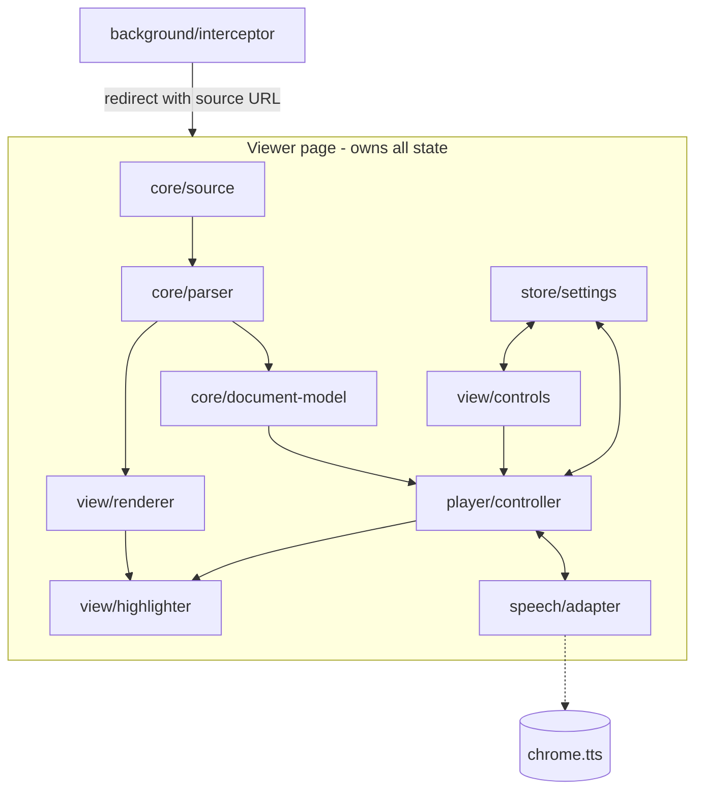

# PDF Reader — Architecture

Status: **done and in daily use. All eight phases, 0 through 7, are built and confirmed in Chrome.** The extension intercepts PDFs, opens them in its own viewer, renders them with a selectable text layer, turns their text into sentences with word geometry, reads them aloud, highlights each word as it is spoken, and remembers the voice, the speed and where you stopped.

Phases 0-6 were v1. **Phase 7 came after it** and added click-to-read, the first item taken off section 12.

Nothing in the plan is outstanding. Section 12 is the list of what could come next, and every item on it is marked not required.

**This is the design document, not the user's one.** [README.md](README.md) says what the extension does and how to install it; this says how it is built, what was measured to justify it, and what each phase actually found. It was written as a plan and kept as a record — every phase's findings are folded back into the design sections, so those can be read as fact rather than intention. Sections 1-9 are the design; section 11 is the phase-by-phase record and the place to pick up work.

## 0. Where things stand

| Phase | State | Notes |
|---|---|---|
| 0 — Voice probe | **done** | `chrome.tts` exposes 7 local `(Natural)` voices with word events. Findings in 2.5 |
| 1 — Shell, interception, manual entry | **done** | Redirect fires on `file://` too. `manifest.json`, `background.js`, `viewer.*` |
| 2 — Render | **done** | pdf.js 6.2.108 vendored. `core/source.js`, `core/parser.js`, `view/renderer.js`. Exit criteria run in Chrome, all passed |
| 3 — Text model | **done** | `core/document-model.js`. Run against 8 real PDFs outside Chrome, then confirmed in the viewer; open question 4 answered in 2.6 |
| 4 — Audio | **done** | `speech/adapter.js`, `player/controller.js`. Word mapping proved in node (2.7), then playback confirmed in Chrome |
| 5 — Highlight | **done** | `view/highlighter.js` + an overlay in `view/renderer.js`. Confirmed in Chrome; phase 4's open question answered |
| 6 — Controls, settings, resume | **done** | `view/controls.js`, `store/settings.js`, wiring in `viewer.*`. Confirmed in Chrome |
| 7 — Click to read | **done** | Section 12 item 2. `wordAtPoint` in `core/document-model.js`, `locate` in `view/renderer.js`, wiring in `viewer.js`. Hit test checked in node, then confirmed in Chrome |

**To pick up work:** read section 3 (module map), then section 12 for the candidates. Everything phases 0-6 discovered is folded into the design sections, so those can be trusted as written rather than re-verified.

**Phase 6 needed nothing from `player/controller` or `speech/adapter`.** Both were left untouched: the controller already exposed `setVoice`, `setRate`, `next` and `previous` and already accepted a starting `sentenceId`, and the adapter already exported `rateRange` and `chooseVoice`. Phases 4 and 5 having written those for a picker that did not exist yet is why phase 6 was the smallest phase of the six.

**Verified by hand, not by tests.** There is no test suite. Each phase was checked by loading the unpacked extension and using it — the exit criteria in section 11 are the checklist. Phase 3 is the exception: `core/document-model.js` imports nothing, so it was also run over real PDFs in node (see 2.6) before being confirmed in the viewer.

**Nothing is owed to the browser.** Every phase has had its exit criteria run in Chrome, phase 7 included. One row of section 8 is the exception and is marked as such in that table: a mid-document TTS engine failure cannot be provoked on demand, so its handling is written and reasoned but never seen firing.

## 1. What we are building

A Chrome extension that opens a PDF in its own viewer and reads it aloud using the text-to-speech voices Chrome already has on the machine, highlighting each word as it is spoken.

### Goals

- Read any text-based PDF aloud, from the web or from local files.
- Use Chrome's built-in neural voices. Ship no TTS model of our own.
- Highlight the current word and sentence in sync with the audio.
- Keep the document on the machine. No network calls with PDF content.
- Remember where the user stopped in a document.

### Non-goals (for v1)

- Scanned PDFs. No text layer means OCR, which is a separate project.
- Cloud voices. We measured these as unusable (see 2.3).
- Annotation, form filling, editing, search.
- Reading non-PDF pages. `reading-mode` already covers that.

## 2. Constraints we measured

These are not assumptions. Each was verified on this machine before writing this document.

### 2.1 Chrome's PDF viewer cannot be scripted

Chrome renders PDFs in an internal component backed by PDFium in a separate plugin frame. Extensions cannot inject content scripts into it, read its text, or drive its selection. This is a security boundary with no workaround.

**Consequence:** we must replace the viewer, not enhance it. This single fact drives most of the design.

### 2.2 Chrome's neural voices run locally and are reachable

Chrome ships a `WasmTtsEngine` component:

```
~/Library/Application Support/Google/Chrome/WasmTtsEngine/<version>/
  bindings_main.wasm    22M    <- synthesis engine
  voices.json           48K    <- voice model catalog
```

Its manifest declares `host_permissions` for `dl.google.com` and `gvt1.com` only — download endpoints. There is no synthesis API URL anywhere in the code. Voice models are downloaded once (~12-15MB per language) and cached in the component's IndexedDB. Audio is generated locally and streamed into an `AudioWorklet`.

**Consequence:** the `(Natural)` voices give us neural quality, offline, with no model to ship and no privacy cost.

### 2.3 Measured voice behaviour

Same text (1170 chars, 162 words) through three voices:

| Voice | First audio | `onstart` fires | Boundary events | Usable |
|---|---|---|---|---|
| `Google US English 1 (Natural)` | 3001 ms | **8** | 324 (2/word, distinct indices) | yes |
| `Samantha` (macOS local) | 161 ms | 1 | 162 (1/word) | yes |
| `Google US English` (network) | — | — | **0** | **no** |

Short sentence (55 chars), Natural voice: first audio **122-410 ms**.

Four consequences that shape the design:

1. **Network voices are out.** Zero boundary events means no word highlighting is possible. A remote service returns finished audio and cannot report per-word timing.
2. **Chunk by sentence.** Natural's startup delay scales with input size — 3 seconds for a paragraph, ~200 ms for a sentence. The engine synthesizes a block before playing it. Sentence chunking keeps this imperceptible.
3. **`onstart` is not "playback began."** It fires exactly 8 times per utterance regardless of length. Latch on the first, ignore the rest.
4. **Natural emits two boundary events per word** at *distinct* character positions, likely word start and word end. Deduping on `charIndex` will not collapse them. Map each `charIndex` to its containing word and only emit a position change when the word changes.

Both voices honour `rate` correctly across 0.6-2.5.

### 2.4 Platform constraints

- `chrome.tts` is not subject to the user-activation gate that blocks `speechSynthesis` on a page. This is why we build on `chrome.tts`.
- MV3 service workers suspend after ~30s idle. Playback state must not live there.
- `file://` PDFs need the user to enable "Allow access to file URLs" manually. This cannot be requested programmatically.
- Voice availability is per-machine. Natural voices need Chrome's component download; macOS Enhanced/Premium voices need a manual download by the user. A fallback chain is mandatory.

### 2.5 Confirmed through `chrome.tts` (phase 0)

Everything in 2.3 was measured through `speechSynthesis`. Phase 0 re-ran it through `chrome.tts.getVoices()` and `chrome.tts.speak()`, which is what we actually build on. **Open question 1 is answered: yes.**

`getVoices()` returned 212 voices, including **7 `(Natural)` voices**, all `remote: false`, all declaring `word` in `eventTypes`. Three families are visible:

| Family | Count | `remote` | `eventTypes` |
|---|---|---|---|
| macOS system voices (Samantha, Rishi, Daniel, novelty voices…) | 186 | local | `start end word pause resume` |
| `Google …` network voices | 19 | **remote** | `start end interrupted cancelled error` — **no `word`** |
| `Chrome OS US English 1-8` and `Google US English 1-7 (Natural)` | 15 | local | `start end word interrupted cancelled error` |

Speak test, rate 1.0:

| Voice | Text | First `start` | `start` events | `word` events | Distinct `charIndex` | Words | Per word |
|---|---|---|---|---|---|---|---|
| `Google US English 1 (Natural)` | 56 chars | 771 ms | **8** | 20 | 20 | 10 | **2.00** |
| `Google US English 1 (Natural)` | 573 chars | 1329 ms | **8** | 182 | 182 | 91 | **2.00** |
| `Rishi` (macOS local) | 56 chars | 158 ms | 1 | 10 | 10 | 10 | 1.00 |
| `Rishi` (macOS local) | 573 chars | 9 ms | 1 | 91 | 91 | 91 | 1.00 |

What this changes:

1. **Both Natural quirks are confirmed exactly, through `chrome.tts`.** 8 `start` events regardless of length, and 2.00 `word` events per word at fully distinct `charIndex` values. Sections 5.1 and 6 stand as written.
2. **`eventTypes` is trustworthy.** Every remote voice omits `word`; every local one declares it. So `VoiceInfo.supportsWordEvents` is just `eventTypes.includes("word")` — no probing speak needed to build the picker.
3. **Startup latency is less alarming than 2.3 suggested.** The 3001 ms paragraph figure did not reproduce: 1329 ms for a comparable block, and the second Rishi run came back in 9 ms, so part of what 2.3 measured was engine warm-up rather than per-utterance cost. Sentence chunking is still right — 771 ms for one sentence is too long to sit through at a document boundary — but pre-buffering (section 6) matters more than the raw numbers implied. Still deferred, still worth measuring in phase 4.
4. **The `pause`/`resume` event types on macOS voices are not a reason to use `chrome.tts.pause()`.** Natural voices do not offer them, and section 6's stop-and-remember keeps one code path across both families.

### 2.6 Measured sentence splitting (phase 3)

`core/document-model.js` imports nothing — it is handed an item array and reads only `str`, `transform`, `width`, `height` and `hasEOL`. That made it runnable in plain node against real documents, which is how the numbers below were produced. The harness is throwaway; it used the `pdfjs-dist` **legacy** build, because the vendored browser build of pdf.js will not load outside a browser.

Eight documents, first 25 pages of each:

| Document | Sentences | Words | Median | Rejoined hyphens |
|---|---|---|---|---|
| HBR article, 2-column | 260 | 5,069 | 19 w | 136 |
| ACM paper, 2-column, heavy footnotes | 747 | 14,196 | 18 w | 13 |
| Simon, *Sciences of the Artificial* | 297 | 6,624 | 21 w | 0 |
| Gabriel, *Patterns of Software* | 388 | 8,365 | 21 w | 96 |
| McLuhan, *Understanding Media* (OCR) | 329 | 6,985 | 20 w | 2 |
| Deloitte report, mixed layout | 366 | 7,502 | 20 w | 5 |
| Passport scan | **0** | 0 | — | 0 |
| Résumé | 27 | 808 | 39 w | 0 |

**Open question 4 is answered: naive splitting is good enough.** A 17-22 word median across single-column, two-column and report layouts is exactly the sentence-sized chunk section 2.3 asks for. Two-column reading order came out correct on both papers — pdf.js emits content-stream order, and both laid their columns out in reading order.

Three things the run changed:

1. **A length cap was necessary.** Tables of contents, code listings and tables carry no sentence punctuation and came out as single runs of 100-223 words. At section 2.5's latency, that is seconds of silence with no place to pause. `MAX_SENTENCE_WORDS = 45`, cut at the last clause break (`,;:)—`) before the cap. It changed no word counts — nothing is lost, only divided.
2. **Empty extraction falls out for free.** The passport scan produced zero sentences, so `model.hasText()` is just "any words in the first few pages", and it looks past page 1 because a text PDF often opens on an image cover.
3. **Hyphen rejoining earns its place.** 136 rejoins in a ten-page article. `Word.rects` holding both halves, as section 4 planned, is what makes those speakable as one word and highlightable across the line break.

**Known limits, accepted (section 10's stance: fix only what really breaks).**

- **Running headers and footers merge into the first sentence of a page** — `77:4 Allen Wirfs-Brock and Brendan Eich extensions.` This is the most audible defect and the first thing to fix if reading aloud proves annoying. It needs repeated-text detection across pages, not layout analysis.
- **Footnote markers land mid-sentence** and footnote bodies are spoken at the end of the page: `...the natural laws governing 14.`
- **Hyphenated compounds that fall on a line break lose their hyphen.** Rejoining cannot tell `well-known` from `under-\nstand`.
- **Intra-word gaps in kerned PDFs survive** — `Psycholo gy of New-Pro duc t Adoption`. The item boundaries are where the producer put them.
- **Word rects interpolate on character count.** pdf.js reports no per-glyph advances, so a word's box drifts a few points inside a proportional font. ~~Phase 5 decides whether that is visible.~~ **It decided: not visible enough to matter.** The highlight reads as sitting on the right word. Phase 5 grows both bands two pixels with a shadow spread, which covers the drift and the baseline-anchored rect at the same time.

### 2.7 Word mapping, proved without Chrome (phase 4)

`player/controller.js` imports nothing either, so the same trick that checked sentence splitting in 2.6 works on the playback loop: hand it a fake model and a fake adapter that behaves like a Natural voice — 8 `start` events, then two `word` events per word, at the word's first character and at the character just past it.

Two sentences, 10 words, one utterance each. The controller emitted **10 word positions, no duplicates, in order**, plus one `wordIndex: -1` per sentence when the utterance starts. So Natural's double boundary events collapse, and `onDone` advances to the next sentence.

The mapping rule that does it: **the last word starting at or before `charIndex`**, then emit only when the index changes. A range test (`start <= i < end`) would have dropped the second event by accident; the last-start-before rule drops it on purpose and also survives the other possible reading of Natural's second event — that it points at the *next* word's start.

**Phase 5 settled which reading is right.** With the highlight on screen, it tracked the voice rather than running a word ahead, so Natural's second event is the **word's end**. The rule would have worked either way; it is worth knowing it did not have to.

This settled the third exit criterion before Chrome ever ran the code. The other two are audible facts and were checked by listening, as phase 4 records.

## 3. Module map

The design separates **what the document says** from **how it is spoken** from **how it is drawn**. These three change for different reasons and should never import each other.



### Layer responsibilities

| Module | Responsibility | Must not know about |
|---|---|---|
| `background/interceptor` | Detect PDF navigation, redirect to our viewer; toolbar/context-menu entry points | PDF content, speech, UI |
| `core/source` | Turn a URL or a picked file into bytes, and hash them for the document key | pdf.js, speech |
| `core/parser` | pdf.js wrapper: page rendering + raw text items | Sentences, speech, UI |
| `core/document-model` | Raw text items → words, sentences, blocks, with geometry | pdf.js, speech, DOM |
| `player/controller` | Queue, scheduling, play/pause/seek, current position | pdf.js, DOM, voice specifics |
| `speech/adapter` | Speak a string, report word position, stop | Documents, pages, DOM |
| `view/renderer` | Draw pages and the selectable text layer | Speech, sentences |
| `view/highlighter` | Paint word/sentence highlight from a position event | Speech engines, pdf.js |
| `view/controls` | Buttons, voice picker, rate slider | Everything except controller + settings |
| `store/settings` | Persist voice, rate, last position | Everything else |

**The pivot is `core/document-model`.** Parsing produces it, playback consumes it, highlighting renders it. Keeping it free of both pdf.js and speech types is what makes the other parts independently replaceable.

## 4. Data model

```ts
// Built lazily: pageCount is known up front, sentences grow as pages are parsed.
// Pages are always parsed in order, so a Sentence.id never shifts once assigned.
interface DocumentModel {
  pageCount: number
  parsedPages: number          // sentences[] covers pages 0..parsedPages-1
  sentences: Sentence[]        // flat, in reading order
}

interface Sentence {
  id: number                   // index into sentences[]
  page: number
  text: string                 // what we hand to the TTS engine
  words: Word[]
}

interface Word {
  text: string
  start: number                // char offset within Sentence.text
  end: number
  rects: Rect[]                // page coords; multiple if the word wraps
}

// Emitted by the controller as playback advances.
interface Position {
  sentenceId: number
  wordIndex: number            // index into Sentence.words
}
```

`rects` are in PDF page coordinates, not screen pixels. The highlighter converts using the current zoom/scroll. This keeps the model independent of how the page happens to be displayed.

**Document key for resume position:** SHA-256 of the PDF bytes. Survives a file being moved or a URL expiring, which a URL key does not. We already hold the bytes from `core/source`, so it costs one hash.

## 5. Key interfaces

Two seams matter. Everything else can be plain function calls.

### 5.1 Speech adapter

The point of this interface is that we can swap engines later without touching the player. If Chrome's voices disappoint, or we want Piper or Kokoro, only this file changes.

```ts
interface SpeechAdapter {
  listVoices(): Promise<VoiceInfo[]>
  speak(text: string, opts: { voice: string; rate: number }): number  // returns utterance token
  stop(): void
  onWord(cb: (token: number, charIndex: number) => void): void
  onDone(cb: (token: number) => void): void
  onError(cb: (token: number, err: string) => void): void
}

interface VoiceInfo {
  id: string
  label: string
  local: boolean
  supportsWordEvents: boolean   // = eventTypes.includes("word"); false => hide it
}
```

`supportsWordEvents` reads straight off `eventTypes`, which 2.5 confirmed is accurate on every voice on this machine. No probe utterance is needed to populate the picker.

The `chrome.tts` implementation absorbs the quirks measured in 2.3 — the 8 `onstart` calls and the two-events-per-word behaviour — so nothing upstream ever sees them. **This is the main reason the adapter exists.**

The **token** is the third quirk it absorbs. On a seek we stop one utterance and start another; a late event from the old one would drag the highlight backwards. The controller ignores any event whose token is not the current one.

`rate` is clamped to the 0.6-2.5 range measured in 2.3, not the 0.1-10 the API accepts.

### 5.2 Position events

`player/controller` emits `Position`. `view/highlighter` subscribes. They share nothing else. The highlighter can be rewritten (canvas overlay vs. DOM spans) without the player knowing.

## 6. How playback works

1. Controller takes the current `Sentence` and hands `sentence.text` to the adapter.
2. Adapter reports `charIndex` values as words are spoken.
3. Controller maps `charIndex` to a `Word` via `start`/`end`, and emits a `Position` **only when the word index changes**. This is what absorbs Natural's double events.
4. Highlighter paints the word, and the enclosing sentence in a lighter tone.
5. On `onDone`, controller advances to the next sentence.

**Pause is stop-and-remember.** We do not use `chrome.tts.pause()`. Pause stops the utterance and keeps the `Position`; resume re-speaks the current sentence from its start. Sentences are short, so the repeat is small, and it keeps one code path for pause, seek and resume-on-open.

**Pre-buffering (deferred).** We could hand sentence N+1 to a second utterance early to hide the ~200ms synthesis delay. Not in v1 — measure the gap in real use first. Noting it here so the queue design does not make it hard to add.

## 7. Voice selection

Applied at startup, in order:

1. `Google US English 1 (Natural)` if present.
2. Any other voice reporting `local: true` and word events.
3. `Samantha` or the platform default, even if it has no word events.

Voices without word-boundary events are **hidden from the picker** rather than offered and then failing to highlight. But if step 3 is all we have, we still play — audio without highlighting beats no audio, with a one-line note saying why nothing is highlighted.

## 8. Failure handling

| Case | Behaviour |
|---|---|
| PDF not intercepted (see 9, "Interception") | Chrome's viewer opens and we can do nothing to it. Toolbar button and context-menu item re-open the current URL in our viewer |
| PDF has no text layer (scanned) | Detect empty extraction, show "no readable text", do not offer playback |
| `file://` without permission | Show a short explainer with the exact toggle to enable |
| Voice missing at load | Fall through the chain in section 7, tell the user which voice was used |
| TTS `onerror` mid-document | Stop, keep position, offer resume. **The one row never seen firing** — the engine cannot be made to fail on demand. The path is the same stop-and-remember as pause, and the position is already on disk, so a reload resumes even if the notice were wrong |
| Very large PDF | Parse text lazily per page; do not build the whole model up front |

## 9. Decisions taken

**Standalone extension, not part of `reading-mode`.** `reading-mode` injects into someone else's page. This one *is* the page. Different lifecycle, different permissions, different failure modes. Sharing would muddy both. If the Define lookup proves valuable here later, extract it into a shared module then — not now.

**Interception is best-effort, with manual entry always available.** MV3 has no blocking `webRequest`. `declarativeNetRequest` matches on URL only, so it cannot see `Content-Type: application/pdf`. `site.com/report.pdf` is caught; `site.com/download?id=123` is not, and `file://` almost certainly is not either. So redirect is a convenience, never the only way in. The viewer always offers a toolbar button, a context-menu item, and a local file picker. This also sidesteps the `file://` permission toggle in 2.4.

**Bundle pdf.js locally.** MV3's CSP blocks remote script, and `ken107/read-aloud` loads its viewer from `assets.lsdsoftware.com`, which would send document rendering through a third-party host and destroy the privacy property from 2.2.

**Build on `chrome.tts`, not `speechSynthesis`.** No user-activation gate, and it is the extension-native API.

**~~Highlight via pdf.js text layer~~ → overlay from `Word.rects`.** The plan was to reuse pdf.js's invisible selection spans for free geometry. *Reversed in phase 5, and not for the reason expected.* A `Word` keeps no link to the span it came from, so the span route needed provenance added to `core/document-model` — a phase 3 change in service of phase 5. `Word.rects` was already there. The multi-column doubt that made this low confidence never got to decide it. The `Position` seam held: only `view/highlighter.js` and a per-page overlay in the renderer were involved.

## 10. Open questions and current stance

Each question below has a decision attached. The questions stay written down because the *reasons* still matter if a decision has to be revisited — but none of them blocks starting work.

1. ~~**Does `chrome.tts.getVoices()` expose the `(Natural)` voices?**~~
   → **Answered: yes.** Seven of them, local, all declaring `word` events, with both quirks reproducing exactly. See 2.5. `speechSynthesis` is no longer needed as a fallback.

2. **Do macOS Premium voices expose word events?** None are installed here, so untested. If they do, they may become the better default.
   → **Not pursued.** Natural is the default for now. Revisit only if Natural disappoints in real use.

3. ~~**Does `declarativeNetRequest` fire on `file://`?**~~
   → **Answered: yes**, with the "Allow access to file URLs" switch on. Local PDFs are intercepted like any other. Extensionless HTTP URLs remain uncatchable — DNR matches on URL, never on `Content-Type` — and the toolbar button covers them, as section 9 intended.

4. ~~**How well does sentence splitting survive real PDFs?**~~
   → **Answered: well enough.** Eight documents, 17-22 word median, correct two-column order on both papers. See 2.6 for the numbers, the one change it forced (a 45-word cap for unpunctuated tables and code), and the known limits — running headers being the loudest. No layout analysis was needed and none is planned.

## 11. Build phases

Each phase is written to be picked up cold: what to build, which files, and how to know it is done. Phases are strictly ordered — each one is loadable and testable in Chrome on its own.

### Ground rules for every phase

- **No build step.** Plain ES modules, like the sibling extensions in this repo. pdf.js is vendored as its prebuilt `dist` files. The TypeScript in sections 4 and 5 is documentation of shape, not code to compile — write plain JS and keep the shapes.
- **Load path.** `chrome://extensions` → Developer mode → "Load unpacked" → this directory. Reload after every change to `background.js`.
- **Do not skip ahead.** Section 3's rule holds: `core/*`, `player/*`, `speech/*` and `view/*` never import each other except along the arrows in the module map.
- **Stop and report** if a phase's exit criteria cannot be met. Several phases exist to answer an open question from section 10, and a "no" answer changes the design rather than being worked around.

### Target file layout

Reached by the end of phase 6. Earlier phases create only their own files.

```
pdf-reader/
  manifest.json
  background.js              # background/interceptor, incl. the redirect rules
  viewer.html                # the viewer page
  viewer.js                  # wiring only: builds the modules, connects them
  viewer.css
  core/source.js
  core/parser.js
  core/document-model.js
  player/controller.js
  speech/adapter.js
  view/renderer.js
  view/highlighter.js
  view/controls.js
  store/settings.js
  lib/pdf.mjs                # vendored pdf.js dist
  lib/pdf.worker.mjs
  icons/
```

---

### Phase 0 — Voice probe ✅ done

**Retired the risk in** open question 1. Results are in section 2.5; the throwaway extension has been deleted. Nothing further to do here.

---

### Phase 1 — Shell: manifest, interception, manual entry ✅ done

**Answered** open question 3, better than expected: the dynamic rule **does** fire on `file://` main-frame navigations, so opening a local PDF from Finder or a `file://` link lands in our viewer. `*.pdf` HTTP URLs are caught as designed; extensionless URLs still are not, and the toolbar button covers those.

**Files:** `manifest.json`, `background.js`, `viewer.html`, `viewer.js`, `viewer.css`, `icons/`

- `manifest.json`: MV3. Permissions `declarativeNetRequest`, `storage`, `contextMenus`. `viewer.html` in `web_accessible_resources`.
- `background.js`: registers a **dynamic** `declarativeNetRequest` rule redirecting `*.pdf` main-frame navigations to `viewer.html?src=<original URL>`. Dynamic rather than a static `rules.json` because `regexSubstitution` needs an absolute URL, and the extension ID is only knowable at runtime via `chrome.runtime.getURL()` unless the manifest pins a `key`. Also: toolbar action opens the current tab's URL in the viewer, and a context-menu item on links does the same.
- The original URL is appended **raw**, not encoded — DNR cannot URL-encode during substitution. `viewer.js` therefore reads everything after `?src=` literally instead of via `URLSearchParams`, so a query string inside the PDF URL survives.
- `viewer.html`: reads `?src=`, shows the URL and a file picker. No PDF rendering yet.

**Exit criteria**

- A `.pdf` link lands on the viewer page showing the source URL.
- The toolbar button works on a PDF that was *not* intercepted.
- Picking a local file logs its name and byte length.
- **Record in section 9** what interception actually caught: `file://` yes/no, and how extensionless PDF URLs behaved.

---

### Phase 2 — Render ✅ done

**Files:** `core/source.js`, `core/parser.js`, `view/renderer.js`

Two things learned while building it, both recorded because they are not obvious:

- **`fetch()` refuses the `file:` scheme** even with "Allow access to file URLs" granted. `XMLHttpRequest` still honours it, so `core/source.js` uses XHR for `file://` and `fetch` for everything else. A successful `file://` read reports `status: 0`.
- **pdf.js is vendored at v6.2.108**, as `lib/pdf.mjs`, `lib/pdf.worker.mjs` and `lib/standard_fonts/` (~3.7 MB total). `cmaps/` was left out — it is only needed for CJK documents, and can be added if one turns up. In v6, `page.render()` takes `canvas` directly and the text layer is the `TextLayer` class.

- `core/source.js`: URL or `File` → `ArrayBuffer`, plus SHA-256 of the bytes via `crypto.subtle.digest` as the document key.
- `core/parser.js`: wraps pdf.js. Opens the buffer, exposes `pageCount`, `renderPage(n, canvas, scale)`, `textItems(n)`. **Nothing above this file imports pdf.js.**
- `view/renderer.js`: renders pages into a scrolling column, plus pdf.js's text layer for selection.

Vendor pdf.js by copying `pdf.mjs` and `pdf.worker.mjs` from a release build into `lib/`. Set the worker path to the packaged file — no CDN (section 9).

**Exit criteria** — all met in Chrome

- ✅ A multi-page PDF renders, scrolls, and text is selectable with the mouse. The v6 `page.render({ canvas })` call and the `TextLayer` class both behave as written.
- ✅ Works for an intercepted URL, a manually opened URL, and a picked local file.
- ✅ The extension is already useful as a plain PDF viewer.
- ✅ **The watch item did not bite.** Sizing every page up front with one `getViewport` call was not slow enough to notice, so the scrollbar stays honest and the uniform-page-size fallback is not needed. Revisit only if a much larger document turns up.

---

### Phase 3 — Text model ✅ done

**Answered** open question 4, the largest unknown. Results, numbers and known limits are in 2.6.

**Files:** `core/document-model.js`, plus wiring in `viewer.js`

The pipeline is four small steps: items → lines (on `hasEOL`, with a baseline-jump fallback) → words (rejoining hyphens across line ends) → one page string with every word's offset into it → sentence ranges over that string. Building the page string first is what makes the offsets in `Word.start`/`end` fall out for free rather than being tracked through the split.

Two things worth knowing before touching it:

- **The model imports nothing.** That is not tidiness — it is what let the splitting be run over eight real PDFs in node before Chrome ever saw it. Keep it that way and the next change can be checked the same way.
- **Word rects are interpolated on character count**, because pdf.js reports no per-glyph advances. Section 4's `rects` array holds one entry per line the word spans, so a hyphen-rejoined word carries both halves.

**Exit criteria** — all met

- ✅ Debug mode: `pdfReader.sentences()`, `pdfReader.sentences(page)` or `pdfReader.sentences(from, to)` from the viewer's devtools console prints a table of id, page, word count and text. It is a console object rather than a URL flag because the interceptor appends the source URL raw, so anything after it reads as part of that URL.
- ✅ Run against eight structurally different PDFs — two-column papers, single-column books, an OCR'd scan, a report and a résumé.
- ✅ Failures written down as known limits in 2.6.
- ✅ Empty extraction detected: `model.hasText()` returned false on a passport scan, and `viewer.js` shows the section 8 notice.
- ✅ Confirmed in the viewer: the load line logs page count, document key and sentence count, and `pdfReader.sentences()` prints the same text in Chrome that the node harness produced.

---

### Phase 4 — Audio ✅ done

**Files:** `speech/adapter.js`, `player/controller.js`, plus wiring in `viewer.js`, a play/pause button, and the `tts` permission

- `speech/adapter.js`: the section 5.1 interface over `chrome.tts`. It absorbs all three quirks — latch the first of 8 `onstart` calls, pass `charIndex` through raw, and stamp every event with the utterance **token**. Clamp `rate` to 0.6–2.5. Set `supportsWordEvents: false` for any voice whose `eventTypes` lacks `word`. Section 7's chain lives here too, as `chooseVoice()`, because it is a fact about voices rather than about the player — phase 6's picker uses the same function.
- `player/controller.js`: holds the queue and the current `Position`. Speaks one sentence at a time, advances on `onDone`, and drops any event whose token is stale. Pause is stop-and-remember (section 6). Emits `Position` to subscribers.

Four things worth knowing:

- **`chrome.tts` needs the `tts` permission.** Nothing in phases 0-3 required it, so the extension must be reloaded at `chrome://extensions` before any of this runs.
- **`chooseVoice()` returns `null` when nothing matches**, meaning "let the platform decide" — `chrome.tts` uses its default when `voiceName` is left off. That is section 7's step 3 without having to name a voice that may not exist.
- **The controller pre-parses the next page** while the current sentence is speaking. Parsing mid-sentence would be heard as a gap. This is text only; audio pre-buffering stays deferred, as section 6 says.
- **`pdfReader.trace = true`** in the viewer's console logs every `Position`. `pdfReader.voices()` lists what the machine has.

**Exit criteria** — met

- ✅ A document plays end to end without gaps, stalls, or repeats at sentence boundaries. Confirmed by hand in Chrome: opening a PDF and pressing **Read aloud** starts speech and keeps going across sentence and page boundaries.
- ✅ Pause and resume land on the same sentence.
- ✅ `Position` events log correctly, one per word — Natural's double boundary events collapse to one. **Proved in node** (2.7).

~~**One question 2.7 left open, and phase 5 is where it lands.**~~ **Answered in phase 5: the word's end.** Natural's second boundary event per word could have been either that or the next word's start, and audio alone could not tell them apart. The highlight tracked the voice instead of leading it, so it is the end. Nothing had to change.

---

### Phase 5 — Highlight ✅ done

**Answered** the question phase 4 left open: Natural's second boundary event is the word's end. See the exit criteria below.

**Files:** `view/highlighter.js`, plus an overlay per page in `view/renderer.js`, styles in `viewer.css`, wiring in `viewer.js`

**The text layer lost, before it was tried.** Section 9 wanted the pdf.js spans first. That route needs a link from a `Word` back to the span it came from, and the model has none: `tokensFromItem` drops the item index, and hyphen-rejoining merges tokens across items. Using spans would have meant adding provenance to `core/document-model` — a phase 3 change to serve a phase 5 need. `Word.rects` already exists for exactly this, so **the overlay won on cost, not on geometry**. Section 9's multi-column worry never got to be the deciding factor.

How it fits together:

- `view/renderer` gains a `.highlight-layer` div per page, between the canvas and the text layer, and two calls: `overlay(page)` and `toPixels(page, rect)`. The conversion lives there because it uses the pdf.js viewport, which nothing above `core/parser` and `view/renderer` may see. It converts **both corners** of a rect rather than multiplying by the scale, so a rotated page stays correct.
- Every slot gets its viewport in `buildSlots`, before anything rasterises, so a sentence on a page that has not been drawn yet still highlights.
- `view/highlighter` takes a `Sentence` and a word index — not a `Position`. `viewer.js` does the `model.sentence(id)` lookup, which keeps the section 5.2 seam as narrow as it was and the highlighter free of the model.
- The sentence is drawn as **one band per line**, merged only against the most recent band. Words arrive in reading order, so that joins a line correctly and, on a two-column page, stops the two columns — which sit at the same height — from merging into one band across the gutter.
- Both bands are grown two pixels with a `box-shadow` spread. 2.6's rects are interpolated on character count and sit on the baseline, so a tight box clips descenders.
- Scroll-into-view fires **only when the word has left the band** between the header and the bottom margin, and then not again for 450 ms. Following every word would scroll on every event; re-measuring during a smooth scroll would see the old position and issue a second one.
- Zoom rebuilds every page and takes the overlays with it, so `applyZoom` is now async and calls `highlighter.refresh()`.
- **`pdfReader.highlight(id, word)`** paints a sentence without playing it, so the geometry can be checked against the page on its own.

**Exit criteria** — all met, confirmed by hand in Chrome

- ✅ Highlight tracks the audio with no visible lag.
- ✅ Scroll-into-view is not jumpy. The leave-the-band rule plus the 450 ms settle was enough; no tuning was needed.
- ✅ **Phase 4's open question is answered.** The highlight did *not* run a word ahead of the voice, so Natural's second boundary event per word is the **word's end**, not the next word's start. `wordAt`'s last-start-before rule stands as written and 2.7's contingency is not needed.
- ✅ Record which approach won and why.

---

### Phase 6 — Controls, settings, resume ✅ done

**Files:** `view/controls.js`, `store/settings.js`, plus wiring in `viewer.js`, `viewer.html`, `viewer.css`

- `store/settings.js`: the only file that touches `chrome.storage`. It keeps two things apart — `prefs` (`voice`, `rate`) for the whole extension, and `positions` keyed by the phase 2 document hash. Voice and speed are properties of the reader, not of a document, so they are not per-key. Every read and write is wrapped: storage failing is not a reason to refuse to read a PDF aloud.
- `view/controls.js`: builds its own markup into an empty `#controls` in the header — previous sentence, play/pause, next sentence, a speed slider over `speech/adapter`'s exported `rateRange`, and the voice picker. It reports changes through handlers and touches neither the player nor storage, so `viewer.js` stays the only place that knows a voice change means "tell the controller **and** remember it".
- The picker hides voices without word events (section 7), with one exception: a voice already speaking is always listed, because if the chain fell through to one, the picker must show what is actually being heard. Voices are grouped into Natural and System, since the seven Natural voices otherwise sit buried among ~190 macOS ones.
- Resume **seeks** rather than only starting there. `seek` emits a `Position` even when paused, so the highlight paints and the page scrolls into view: the resume is visible before anything is spoken. The notice offers "start from the beginning", which forgets the position and seeks to 0.
- Reaching the end **clears** the position. Keeping it would reopen a finished document on its last sentence forever.
- Position is written once per sentence, not once per word — the changed-sentence test in `viewer.js`'s `onPosition`. At any speed that is a write every few seconds.
- **`chrome.tts` outlives the page.** Closing the tab mid-sentence left the voice talking, so `viewer.js` stops speech on `pagehide`. Not something any earlier phase could have noticed, since nothing before this one kept playing long enough to close the tab on.
- **`pdfReader.forget()`** drops this document's remembered position, which is how the resume path gets re-tested without hunting for a fresh PDF.

Three decisions worth knowing, none of them forced by the plan:

1. **Voice and rate are global, position is per-document.** Per-document voices would mean a picker that silently changes meaning as you open files.
2. **The rate slider commits on `change`, not `input`.** Every commit restarts the current sentence (section 6's stop-and-remember), so committing per drag step would stutter.
3. **`positions` is capped at 200 entries**, oldest-read dropped first. Not about space — records are tiny — but about a map that would otherwise grow forever with documents opened once.

**Exit criteria** — met, confirmed by hand in Chrome

- ✅ Reopening a document restores the last position, voice and rate.
- ✅ Every row of the section 8 table behaves as written, and every row that can be triggered on demand was. The mid-document TTS error is the one exception, marked in that table.
- ✅ Usable daily. Nothing needed changing after the check — the phase went in as designed.

---

### Phase 7 — Click to read ✅ done

The first item taken off section 12, chosen because it needed no new module — item 2 there called it "the largest gain per line of code left on the list," and it was.

**Files:** `core/document-model.js` (`wordAtPoint`), `view/renderer.js` (`locate`), wiring in `viewer.js`

Three additions, one per layer, each on the seam that layer already owns:

- **`model.wordAtPoint(page, x, y)`** — a point in PDF page coordinates becomes `{ sentenceId, wordIndex, word }`, or `null` on blank paper. Pure arithmetic over the rects every `Word` already carries, so **the model still imports nothing** and still runs in node. It does not parse: the caller awaits `ensurePages` first, because awaiting inside a lookup would make it look cheaper than it is.
- **`renderer.locate(clientX, clientY)`** — the inverse of phase 5's `toPixels`. It belongs here for the same reason `toPixels` does: it uses the pdf.js viewport, which nothing above `core/parser` and `view/renderer` may see. The page is found with `elementFromPoint().closest(".page")` rather than by measuring every slot, so a 700-page document costs the same as a short one.
- **`viewer.js`** joins the two and calls `player.seek`. No new arrow in the module map — the parts that already talked to each other simply do it in one more direction.

Four decisions worth knowing:

1. **Seeking is by sentence, not by word.** The adapter speaks a whole `Sentence.text`, and starting mid-string would break the `charIndex` → word mapping the controller depends on. 2.6's 17-22 word median means the clicked word is only ever a moment away, so the simple thing is also the barely-worse thing.
2. **A click both reads and selects, so the two have to be told apart.** A click that moved more than 4 px between press and release, or that ends with a non-collapsed selection, is the user selecting text and is ignored. Text selection is why the pdf.js text layer exists (phase 2); losing it to gain click-to-read would be a bad trade.
3. **Clicking plays, it does not only move the cursor.** `seek` is followed by `play` if nothing is speaking. "Read from here" is the feature; requiring a second press on play would make it "move the highlight." A mis-click costs one press of pause.
4. **The cursor stays `text` over the page.** Switching it to `pointer` would advertise clicking at the cost of hiding that the text is selectable. Discoverability of click-to-read is the thing to watch in real use.

**The hit test's rule**, and why it is shaped that way: vertical distance is a **gate** (miss every line by more than 0.7 line heights and the answer is `null`), horizontal distance is a **ranking**. So clicking in a margin, or in the gap between two words, picks the nearest word on that line rather than nothing — but clicking the white space between paragraphs correctly picks nothing. Rects are baseline-anchored, so the few points between one baseline and the next line's ascender are genuinely ambiguous; the nearest line wins there.

**Checked in node first** (`scratchpad/hit-test.mjs`, throwaway), on two synthetic lines with exact per-word geometry: word centres, both margins, the gap between words, the band between lines, and four kinds of miss. All behaved as described above. The same trick as phases 3 and 4 — the model importing nothing keeps paying.

**Exit criteria** — all met, confirmed by hand in Chrome

- ✅ Clicking a word starts reading from its sentence, on the page you clicked.
- ✅ Dragging to select text does **not** start playback, and selection still works normally. The 4 px slop plus the collapsed-selection test was enough; no tuning was needed.
- ✅ Clicking on a page that has been drawn but not yet parsed works — the `ensurePages` await in the handler covers the gap between rendering being driven by scrolling and the model being driven by playback.
- ✅ Clicking blank margin, or between paragraphs, does nothing.
- ✅ Clicking while already playing jumps there rather than stacking two voices. `seek`'s existing stop-and-speak path (section 6) needed no change.
- ✅ Works at a zoom other than 100%, since `locate` goes through the viewport.

**Nothing had to change after the check.** Like phase 6, it went in as designed — which is what the node pass buys: the geometry was already right before Chrome saw it, so the only things left to be wrong were the DOM-level ones, and they were not.

---

---

## 12. What could come next

v1 is finished and none of this is required. It is written down so a later session can start from a list rather than from memory, roughly in the order it is likely to be worth doing. **Nothing here is committed** — pick from it after using the extension, not before.

**Wait for real use to decide.** These are all fixes to things that may or may not turn out to be annoying:

1. **Running headers and footers merging into the first sentence of a page** (2.6). **Not required.** Named there as the loudest defect: `77:4 Allen Wirfs-Brock and Brendan Eich extensions.` It needs repeated-text detection across pages — a `core/document-model` change, and one that can be checked in node the way phase 3 was, since the model still imports nothing.
2. ~~**Click a word to read from there.**~~ **Done — phase 7.** It was what the entry said it was: a hit test plus `player.seek`, no new module. What the entry did not anticipate is that the hard part is sharing the click with text selection, not the geometry.
3. **Keyboard shortcuts** — space for play/pause, arrows for skip. **Not required.** Deliberately left out of phase 6: space also scrolls, so it needs a decision about focus rather than a `keydown` handler.
4. **Footnote markers mid-sentence and footnote bodies at the end of a page** (2.6). **Not required.** Harder than headers and less audible.

**Already deferred by the design, with the reasoning in place. None of these is required either:**

5. **Pre-buffering sentence N+1** (section 6). **Not required.** The queue was designed not to make this hard. Phase 4 and 5 use did not show a gap worth fixing, so measure before building.
6. **macOS Premium voices** (open question 2). **Not required.** Untested because none are installed. If they report word events they may be the better default.
7. **OCR for scanned PDFs** (non-goal). **Not required.** A separate project, not a feature of this one.
8. **Sharing the Define lookup with `reading-mode`** (section 9). **Not required.** Extract only if it proves valuable here first.

**Where to be careful.** Items 1 and 4 change `core/document-model`, which is the pivot every other module reads through (section 3). Keep it importing nothing — that property is what let phase 3 be checked against eight real PDFs outside Chrome, and it is worth more than any single fix on this list.
