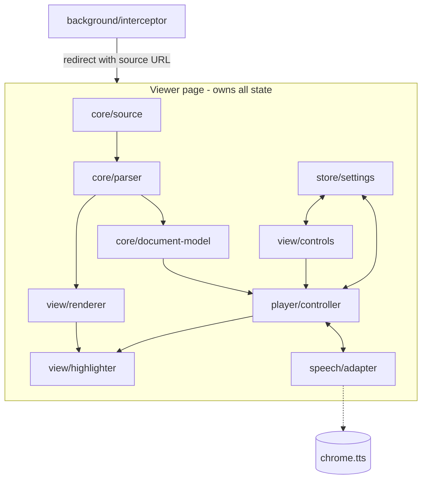

# PDF Reader — Planned Architecture

Status: **planning only**. Nothing is built yet. This document records the design and the measured facts behind it.

## 1. What we are building

A Chrome extension that opens a PDF in its own viewer and reads it aloud using the text-to-speech voices Chrome already has on the machine, highlighting each word as it is spoken.

### Goals

- Read any text-based PDF aloud, from the web or from local files.
- Use Chrome's built-in neural voices. Ship no TTS model of our own.
- Highlight the current word and sentence in sync with the audio.
- Keep the document on the machine. No network calls with PDF content.
- Remember where the user stopped in a document.

### Non-goals (for v1)

- Scanned PDFs. No text layer means OCR, which is a separate project.
- Cloud voices. We measured these as unusable (see 2.3).
- Annotation, form filling, editing, search.
- Reading non-PDF pages. `reading-mode` already covers that.

## 2. Constraints we measured

These are not assumptions. Each was verified on this machine before writing this document.

### 2.1 Chrome's PDF viewer cannot be scripted

Chrome renders PDFs in an internal component backed by PDFium in a separate plugin frame. Extensions cannot inject content scripts into it, read its text, or drive its selection. This is a security boundary with no workaround.

**Consequence:** we must replace the viewer, not enhance it. This single fact drives most of the design.

### 2.2 Chrome's neural voices run locally and are reachable

Chrome ships a `WasmTtsEngine` component:

```
~/Library/Application Support/Google/Chrome/WasmTtsEngine/<version>/
  bindings_main.wasm    22M    <- synthesis engine
  voices.json           48K    <- voice model catalog
```

Its manifest declares `host_permissions` for `dl.google.com` and `gvt1.com` only — download endpoints. There is no synthesis API URL anywhere in the code. Voice models are downloaded once (~12-15MB per language) and cached in the component's IndexedDB. Audio is generated locally and streamed into an `AudioWorklet`.

**Consequence:** the `(Natural)` voices give us neural quality, offline, with no model to ship and no privacy cost.

### 2.3 Measured voice behaviour

Same text (1170 chars, 162 words) through three voices:

| Voice | First audio | `onstart` fires | Boundary events | Usable |
|---|---|---|---|---|
| `Google US English 1 (Natural)` | 3001 ms | **8** | 324 (2/word, distinct indices) | yes |
| `Samantha` (macOS local) | 161 ms | 1 | 162 (1/word) | yes |
| `Google US English` (network) | — | — | **0** | **no** |

Short sentence (55 chars), Natural voice: first audio **122-410 ms**.

Four consequences that shape the design:

1. **Network voices are out.** Zero boundary events means no word highlighting is possible. A remote service returns finished audio and cannot report per-word timing.
2. **Chunk by sentence.** Natural's startup delay scales with input size — 3 seconds for a paragraph, ~200 ms for a sentence. The engine synthesizes a block before playing it. Sentence chunking keeps this imperceptible.
3. **`onstart` is not "playback began."** It fires exactly 8 times per utterance regardless of length. Latch on the first, ignore the rest.
4. **Natural emits two boundary events per word** at *distinct* character positions, likely word start and word end. Deduping on `charIndex` will not collapse them. Map each `charIndex` to its containing word and only emit a position change when the word changes.

Both voices honour `rate` correctly across 0.6-2.5.

### 2.4 Platform constraints

- `chrome.tts` is not subject to the user-activation gate that blocks `speechSynthesis` on a page. This is why we build on `chrome.tts`.
- MV3 service workers suspend after ~30s idle. Playback state must not live there.
- `file://` PDFs need the user to enable "Allow access to file URLs" manually. This cannot be requested programmatically.
- Voice availability is per-machine. Natural voices need Chrome's component download; macOS Enhanced/Premium voices need a manual download by the user. A fallback chain is mandatory.

## 3. Module map

The design separates **what the document says** from **how it is spoken** from **how it is drawn**. These three change for different reasons and should never import each other.



### Layer responsibilities

| Module | Responsibility | Must not know about |
|---|---|---|
| `background/interceptor` | Detect PDF navigation, redirect to our viewer; toolbar/context-menu entry points | PDF content, speech, UI |
| `core/source` | Turn a URL or a picked file into bytes, and hash them for the document key | pdf.js, speech |
| `core/parser` | pdf.js wrapper: page rendering + raw text items | Sentences, speech, UI |
| `core/document-model` | Raw text items → words, sentences, blocks, with geometry | pdf.js, speech, DOM |
| `player/controller` | Queue, scheduling, play/pause/seek, current position | pdf.js, DOM, voice specifics |
| `speech/adapter` | Speak a string, report word position, stop | Documents, pages, DOM |
| `view/renderer` | Draw pages and the selectable text layer | Speech, sentences |
| `view/highlighter` | Paint word/sentence highlight from a position event | Speech engines, pdf.js |
| `view/controls` | Buttons, voice picker, rate slider | Everything except controller + settings |
| `store/settings` | Persist voice, rate, last position | Everything else |

**The pivot is `core/document-model`.** Parsing produces it, playback consumes it, highlighting renders it. Keeping it free of both pdf.js and speech types is what makes the other parts independently replaceable.

## 4. Data model

```ts
// Built lazily: pageCount is known up front, sentences grow as pages are parsed.
// Pages are always parsed in order, so a Sentence.id never shifts once assigned.
interface DocumentModel {
  pageCount: number
  parsedPages: number          // sentences[] covers pages 0..parsedPages-1
  sentences: Sentence[]        // flat, in reading order
}

interface Sentence {
  id: number                   // index into sentences[]
  page: number
  text: string                 // what we hand to the TTS engine
  words: Word[]
}

interface Word {
  text: string
  start: number                // char offset within Sentence.text
  end: number
  rects: Rect[]                // page coords; multiple if the word wraps
}

// Emitted by the controller as playback advances.
interface Position {
  sentenceId: number
  wordIndex: number            // index into Sentence.words
}
```

`rects` are in PDF page coordinates, not screen pixels. The highlighter converts using the current zoom/scroll. This keeps the model independent of how the page happens to be displayed.

**Document key for resume position:** SHA-256 of the PDF bytes. Survives a file being moved or a URL expiring, which a URL key does not. We already hold the bytes from `core/source`, so it costs one hash.

## 5. Key interfaces

Two seams matter. Everything else can be plain function calls.

### 5.1 Speech adapter

The point of this interface is that we can swap engines later without touching the player. If Chrome's voices disappoint, or we want Piper or Kokoro, only this file changes.

```ts
interface SpeechAdapter {
  listVoices(): Promise<VoiceInfo[]>
  speak(text: string, opts: { voice: string; rate: number }): number  // returns utterance token
  stop(): void
  onWord(cb: (token: number, charIndex: number) => void): void
  onDone(cb: (token: number) => void): void
  onError(cb: (token: number, err: string) => void): void
}

interface VoiceInfo {
  id: string
  label: string
  local: boolean
  supportsWordEvents: boolean   // false => hide it, we cannot highlight
}
```

The `chrome.tts` implementation absorbs the quirks measured in 2.3 — the 8 `onstart` calls and the two-events-per-word behaviour — so nothing upstream ever sees them. **This is the main reason the adapter exists.**

The **token** is the third quirk it absorbs. On a seek we stop one utterance and start another; a late event from the old one would drag the highlight backwards. The controller ignores any event whose token is not the current one.

`rate` is clamped to the 0.6-2.5 range measured in 2.3, not the 0.1-10 the API accepts.

### 5.2 Position events

`player/controller` emits `Position`. `view/highlighter` subscribes. They share nothing else. The highlighter can be rewritten (canvas overlay vs. DOM spans) without the player knowing.

## 6. How playback works

1. Controller takes the current `Sentence` and hands `sentence.text` to the adapter.
2. Adapter reports `charIndex` values as words are spoken.
3. Controller maps `charIndex` to a `Word` via `start`/`end`, and emits a `Position` **only when the word index changes**. This is what absorbs Natural's double events.
4. Highlighter paints the word, and the enclosing sentence in a lighter tone.
5. On `onDone`, controller advances to the next sentence.

**Pause is stop-and-remember.** We do not use `chrome.tts.pause()`. Pause stops the utterance and keeps the `Position`; resume re-speaks the current sentence from its start. Sentences are short, so the repeat is small, and it keeps one code path for pause, seek and resume-on-open.

**Pre-buffering (deferred).** We could hand sentence N+1 to a second utterance early to hide the ~200ms synthesis delay. Not in v1 — measure the gap in real use first. Noting it here so the queue design does not make it hard to add.

## 7. Voice selection

Applied at startup, in order:

1. `Google US English 1 (Natural)` if present.
2. Any other voice reporting `local: true` and word events.
3. `Samantha` or the platform default, even if it has no word events.

Voices without word-boundary events are **hidden from the picker** rather than offered and then failing to highlight. But if step 3 is all we have, we still play — audio without highlighting beats no audio, with a one-line note saying why nothing is highlighted.

## 8. Failure handling

| Case | Behaviour |
|---|---|
| PDF not intercepted (see 9, "Interception") | Chrome's viewer opens and we can do nothing to it. Toolbar button and context-menu item re-open the current URL in our viewer |
| PDF has no text layer (scanned) | Detect empty extraction, show "no readable text", do not offer playback |
| `file://` without permission | Show a short explainer with the exact toggle to enable |
| Voice missing at load | Fall through the chain in section 7, tell the user which voice was used |
| TTS `onerror` mid-document | Stop, keep position, offer resume |
| Very large PDF | Parse text lazily per page; do not build the whole model up front |

## 9. Decisions taken

**Standalone extension, not part of `reading-mode`.** `reading-mode` injects into someone else's page. This one *is* the page. Different lifecycle, different permissions, different failure modes. Sharing would muddy both. If the Define lookup proves valuable here later, extract it into a shared module then — not now.

**Interception is best-effort, with manual entry always available.** MV3 has no blocking `webRequest`. `declarativeNetRequest` matches on URL only, so it cannot see `Content-Type: application/pdf`. `site.com/report.pdf` is caught; `site.com/download?id=123` is not, and `file://` almost certainly is not either. So redirect is a convenience, never the only way in. The viewer always offers a toolbar button, a context-menu item, and a local file picker. This also sidesteps the `file://` permission toggle in 2.4.

**Bundle pdf.js locally.** MV3's CSP blocks remote script, and `ken107/read-aloud` loads its viewer from `assets.lsdsoftware.com`, which would send document rendering through a third-party host and destroy the privacy property from 2.2.

**Build on `chrome.tts`, not `speechSynthesis`.** No user-activation gate, and it is the extension-native API.

**Highlight via pdf.js text layer, not a custom canvas overlay.** pdf.js already positions invisible text spans over the canvas for selection. Reusing them gives correct geometry for free. *Low confidence* — this may not survive contact with multi-column layouts, where model sentences will cross span boundaries. If it fails, fall back to drawing `Word.rects` on an overlay canvas. The `Position` seam means only the highlighter changes.

## 10. Open questions and current stance

Each question below has a decision attached. The questions stay written down because the *reasons* still matter if a decision has to be revisited — but none of them blocks starting work.

1. **Does `chrome.tts.getVoices()` expose the `(Natural)` voices?** All measurements so far used `speechSynthesis`. It routes through the same platform stack, so it should, but this is unverified and the whole design rests on it.
   → **Proceed on the assumption that it does.** Phase 0 verifies it in a few minutes, so the risk is cheap to retire. If it turns out false, the fallback in phase 0 applies and only `speech/adapter.js` is affected.

2. **Do macOS Premium voices expose word events?** None are installed here, so untested. If they do, they may become the better default.
   → **Not pursued.** Natural is the default for now. Revisit only if Natural disappoints in real use.

3. **How much can `declarativeNetRequest` actually catch?** Specifically: does it fire on `file://` at all, and how many real-world PDF URLs lack a `.pdf` path?
   → **Accepted as-is.** Interception is best-effort by design (section 9) and manual entry is the guaranteed path. Phase 1 records what it caught; that record informs nothing more than expectations.

4. **How well does sentence splitting survive real PDFs?** Headers, footers, footnote markers, hyphenated line breaks and multi-column layouts all corrupt naive splitting. This is the largest unknown and the bulk of the real work.
   → **Start simple and iterate.** Ship the naive split from phase 3, run it on real documents, and fix only what actually breaks. Do not build layout analysis up front.

## 11. Build phases

Each phase is written to be picked up cold: what to build, which files, and how to know it is done. Phases are strictly ordered — each one is loadable and testable in Chrome on its own.

### Ground rules for every phase

- **No build step.** Plain ES modules, like the sibling extensions in this repo. pdf.js is vendored as its prebuilt `dist` files. The TypeScript in sections 4 and 5 is documentation of shape, not code to compile — write plain JS and keep the shapes.
- **Load path.** `chrome://extensions` → Developer mode → "Load unpacked" → this directory. Reload after every change to `background.js`.
- **Do not skip ahead.** Section 3's rule holds: `core/*`, `player/*`, `speech/*` and `view/*` never import each other except along the arrows in the module map.
- **Stop and report** if a phase's exit criteria cannot be met. Several phases exist to answer an open question from section 10, and a "no" answer changes the design rather than being worked around.

### Target file layout

Reached by the end of phase 6. Earlier phases create only their own files.

```
pdf-reader/
  manifest.json
  background.js              # background/interceptor
  rules.json                 # declarativeNetRequest static rules
  viewer.html                # the viewer page
  viewer.js                  # wiring only: builds the modules, connects them
  viewer.css
  core/source.js
  core/parser.js
  core/document-model.js
  player/controller.js
  speech/adapter.js
  view/renderer.js
  view/highlighter.js
  view/controls.js
  store/settings.js
  lib/pdf.mjs                # vendored pdf.js dist
  lib/pdf.worker.mjs
  icons/
```

---

### Phase 0 — Voice probe

**Retires the risk in** open question 1. Half an hour at most, and it decides the shape of `speech/adapter.js`, so do it first — but the design assumes it passes, and phases 1 and 2 touch nothing it could invalidate.

Build a throwaway unpacked extension — a service worker and nothing else — that calls `chrome.tts.getVoices()` and logs the full result. Then, from the same worker, `chrome.tts.speak()` one sentence with the best `(Natural)` voice found, with an `onEvent` handler logging every event, and record: does `word` fire, how many times, and with what `charIndex` values.

**Exit criteria**

- The voice list is captured in the doc, with `voiceName`, `remote`, and `eventTypes` for each.
- Confirmed whether a `(Natural)` voice appears **and** emits `word` events.

**If it fails:** the fallback is `speechSynthesis` inside the viewer page, where the play button click supplies the user activation. Only `speech/adapter.js` changes shape; the rest of the design stands. Record the decision here in section 2 before moving on.

Delete the throwaway extension afterwards. Its findings belong in this document, not in the repo.

---

### Phase 1 — Shell: manifest, interception, manual entry

**Answers** open question 3.

**Files:** `manifest.json`, `background.js`, `rules.json`, `viewer.html`, `viewer.js`, `viewer.css`, `icons/`

- `manifest.json`: MV3. Permissions `declarativeNetRequest`, `storage`, `tts`, `contextMenus`. `viewer.html` in `web_accessible_resources`.
- `rules.json`: redirect `*.pdf` main-frame navigations to `viewer.html?src=<original URL>`.
- `background.js`: toolbar action opens the current tab's URL in the viewer; a context-menu item on links does the same.
- `viewer.html`: reads `?src=`, shows the URL and a file picker. No PDF rendering yet.

**Exit criteria**

- A `.pdf` link lands on the viewer page showing the source URL.
- The toolbar button works on a PDF that was *not* intercepted.
- Picking a local file logs its name and byte length.
- **Record in section 9** what interception actually caught: `file://` yes/no, and how extensionless PDF URLs behaved.

---

### Phase 2 — Render

**Files:** `core/source.js`, `core/parser.js`, `view/renderer.js`

- `core/source.js`: URL or `File` → `ArrayBuffer`, plus SHA-256 of the bytes via `crypto.subtle.digest` as the document key.
- `core/parser.js`: wraps pdf.js. Opens the buffer, exposes `pageCount`, `renderPage(n, canvas, scale)`, `textItems(n)`. **Nothing above this file imports pdf.js.**
- `view/renderer.js`: renders pages into a scrolling column, plus pdf.js's text layer for selection.

Vendor pdf.js by copying `pdf.mjs` and `pdf.worker.mjs` from a release build into `lib/`. Set the worker path to the packaged file — no CDN (section 9).

**Exit criteria**

- A multi-page PDF renders, scrolls, and text is selectable with the mouse.
- Works for an intercepted URL, a manually opened URL, and a picked local file.
- The extension is already useful as a plain PDF viewer.

---

### Phase 3 — Text model

**Answers** open question 4, the largest unknown.

**Files:** `core/document-model.js`

Turn `parser.textItems(n)` into `Sentence[]` and `Word[]` per section 4, keeping `rects` in **page coordinates**. Build lazily, page by page, in order.

Start naive: join items into lines, lines into blocks, split blocks on `.?!` followed by whitespace and a capital. Then run it over real PDFs and handle only what actually breaks. Expect trouble from: headers and footers repeating per page, hyphenated line breaks, footnote markers splitting sentences, and multi-column layouts interleaving in the wrong reading order.

**Exit criteria**

- A debug mode logs the sentence list for a document.
- Run against at least three real, structurally different PDFs — a single-column paper, a two-column paper, and something with heavy footnotes.
- Failures are written down here as known limits. Do not chase perfect splitting; get to readable.
- Empty extraction is detected and reported, for the scanned-PDF case in section 8.

---

### Phase 4 — Audio

**Files:** `speech/adapter.js`, `player/controller.js`

- `speech/adapter.js`: the section 5.1 interface over `chrome.tts`. It absorbs all three quirks — latch the first of 8 `onstart` calls, pass `charIndex` through raw, and stamp every event with the utterance **token**. Clamp `rate` to 0.6–2.5. Set `supportsWordEvents: false` for any voice whose `eventTypes` lacks `word`.
- `player/controller.js`: holds the queue and the current `Position`. Speaks one sentence at a time, advances on `onDone`, and drops any event whose token is stale. Pause is stop-and-remember (section 6). Emits `Position` to subscribers.

No UI beyond a play/pause button. No highlighting.

**Exit criteria**

- A document plays end to end without gaps, stalls, or repeats at sentence boundaries.
- Pause and resume land on the same sentence.
- `Position` events log correctly, one per word — **verify Natural's double boundary events collapse to one**.

---

### Phase 5 — Highlight

**Files:** `view/highlighter.js`

Subscribes to `Position`. Paints the current word strongly and the enclosing sentence faintly. Scrolls the page when the position moves off screen.

First attempt is the pdf.js text layer (section 9). If model sentences cross span boundaries and the geometry breaks — likely on multi-column pages — fall back to drawing `Word.rects` on an overlay canvas, converting page coordinates using the current zoom. Only this file changes either way.

**Exit criteria**

- Highlight tracks the audio with no visible lag at rate 1.0 and still holds at 2.0.
- Scroll-into-view is not jumpy.
- Record which approach won and why.

---

### Phase 6 — Controls, settings, resume

**Files:** `view/controls.js`, `store/settings.js`

- `view/controls.js`: play/pause, skip sentence, rate slider, voice picker. Voices without word events are hidden from the picker (section 7).
- `store/settings.js`: `chrome.storage.local` for voice, rate, and last position keyed by the phase 2 document hash.
- Startup applies the section 7 voice chain and, if it lands on a voice without word events, shows the one-line note explaining why nothing is highlighted.
- Implement the remaining rows of the section 8 failure table: the `file://` permission explainer, the no-text-layer message, and resume-after-error.

**Exit criteria**

- Reopening a document restores the last position, voice and rate.
- Every row of the section 8 table has been triggered by hand and behaves as written.
- Usable daily.

---

**Deferred past v1:** pre-buffering sentence N+1 (section 6), OCR, and any sharing of the Define lookup with `reading-mode` (section 9).
